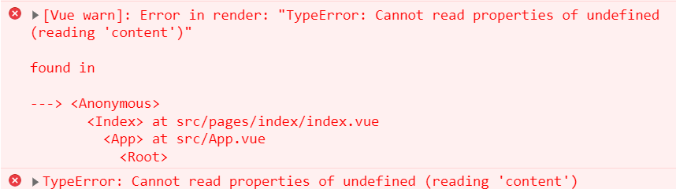
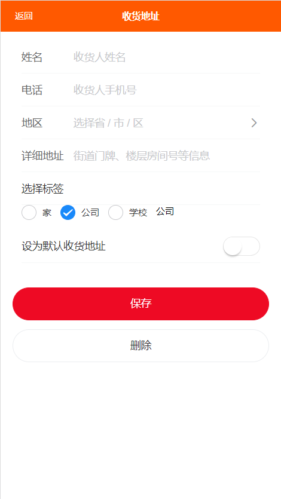

# 1.UI框架介绍

- 用于PC端管理系统
  - Element-ui   https://element.eleme.cn/#/zh-CN/component/installation
  - iview   https://www.iviewui.com/
  - Antdesign   https://www.antdv.com/docs/vue/introduce-cn/
  
  
- 用于移动端界面
  - Minit-ui  https://mint-ui.github.io/#!/zh-cn
  - Vant-ui  https://vant-contrib.gitee.io/vant/v2/#/zh-CN/
  - Ydui   http://vue.ydui.org/

# 2、element-ui使用

- 首先使用vue-cli脚手架快速创建一个项目框架。

- 安装element-ui

  - 安装

    ```
    npm i element-ui -S
    ```

  - main.js引入

    ```js
    import Vue from 'vue';
    import ElementUI from 'element-ui';
    import 'element-ui/lib/theme-chalk/index.css';
    
    Vue.use(ElementUI);
    
    ...
    ```

- 使用组件,直接复制使用组件即可！

  ```
    <el-button>默认按钮</el-button>
  ```
  
  

# 3、VantUI使用


## 4、mysql数据库和navicate软件安装

​	mysql数据库需要5.5版本以上

​	Navicate为mysql的可视化辅助管理软件。

## 5、还原数据库


 数据库还原完成。

## 6、启动小U商城后台接口服务

####  1、修改数据库的配置参数。

​	打开shop_api/config/global.js 


#### 2、进入shop_api目录的命令行，执行 npm start 启动项目


## 7、脚手架创建前端项目

输入 vue create myapp 快速创建项目框架


创建完成后，删除 不需要的文件。

拷贝 rem.js  和  reset.css 到 assets目录下。

并且在main.js导入


## 8、安装VantUI 并配置

https://vant-contrib.gitee.io/vant/v2/#/zh-CN/

```
npm i vant@latest-v2 -S
```

导入vant所有组件，将以下代码添加到main.js中

```js
import Vant from 'vant';
import 'vant/lib/index.css';

Vue.use(Vant);
```

重新启动项目，即可在任意vue中使用vant的各种自定义组件。


## 9、设置项目的路由

根据以上结构创建相应的页面组件：


设置 router/index.js 的路由配置：

```js
const routes = [
  {path:"/",redirect:"/index"}, //路由重定向
  {path:"/index",component:index,
    children:[
      {path:"/index/home",component:home},
      {path:"/index/category",component:category},
      {path:"/index/cart",component:cart},
      {path:"/index/mine",component:mine},
    ]
  },
  {path:"/login",component:login},
  {path:"/register",component:register},
  {path:"/login",component:login},
  {path:"/goods",component:goods},
  // 404页面
  {path:"*", component:notfound}
]
```

## 10、公共小组件封装

1） 在components目录下创建公共组件 vheader.vue, 编写页面结构和css等

```html
<!-- 公共页头 -->
<template>
  <div class="header">
    <div @click="goback()">返回</div>
    <div class="title">{{title}}</div>
    <div>{{right}}</div>
  </div>
</template>

<script>
export default {
  props:["title","right"],
  name: "",
  data() {
    return {};
  },
  created() {},
  mounted() {},
  methods: {
    goback(){
      // 实现后退一步
      this.$router.go(-1);
    }
  },
};
</script>
<style scoped>
.header {
  width: 100vw;
  height: 0.8rem;
  position: fixed;
  top: 0;
  left: 0;
  display: flex;
  justify-content: space-around;
  background-color: #ed6a4c;
}
.header div.title {
  flex-grow: 1; /* 宽度自适应 */
  font-size: 0.32rem;
  font-weight: 600;
}
.header div{
  flex: 0 1 1.2rem;
  line-height: .8rem;
  text-align: center;
  color: #fff;
}
</style>
```

2)   在components目录下创建 index.js 

```js
import Vue from "vue";

// 在此注册所有的公共小组件
import vHeader from "./vheader.vue"
Vue.component("vHeader", vHeader)
```

3） 在main.js中引入 components/index.js 

```js
// 导入注册好的所有的公共小组件
import "./components/index"
```

4） 然后在任意的页面组件中直接可以 使用 <v-header></v-header>


## 11) 自定义图标

阿里图标网站：https://www.iconfont.cn/

使用教程：https://www.iconfont.cn/help/detail?spm=a313x.7781069.1998910419.28&helptype=code

一般采用font-class来使用。

第一步，进入我的项目，选择fontclass，再点击下载本地到项目的 src/assets 目录下。


第二步，在main.js中引入图标css 文件

```
import "./assets/font/iconfont.css"
```

第三步，在任意的页面组件中，使用自定义图标样式

```html
<i class="iconfont icon-zuobian"></i>
```

如果需要修改图标样式，就像修改字体一样即可。


## 12） axios 安装配置

#### 安装axios并配置

- 安装：

  ```js
  npm i axios --save 
  ```

- 创建一个js文件。 这个JS文件中进行axios的相关配置

- 创建`common/http.js`配置axios

  - 创建实例
  - 配置拦截器

  ```js
  // 配置axios相关信息
  
  import axios from "axios";
  
  let $axios = axios.create({
      baseURL:"http://localhost:3000",
      timeout:3000
  })
  
  // 配置拦截器
  // 拦截器需要配置 axios使用 之前！
  // 添加请求拦截器
  $axios.interceptors.request.use(function (config) {
      // 在发送请求之前做些什么
      return config;   // 一定要return config ，否则 请求无法成功！
  }, function (error) {
      // 对请求错误做些什么
      return Promise.reject(error);
  });
  
  // 添加响应拦截器
  $axios.interceptors.response.use(function (response) {
      // 对响应数据做点什么
      return response;    // return 内容，否则具体的请求响应里面获取不到数据！
  }, function (error) {
      // 对响应错误做点什么
      return Promise.reject(error);
  });
  
  // 暴露出去！
  export default $axios;
  ```

- 以后在其他组件中要使用axios，导入该模块即可

- ```
  import $axios from "./common/http.js"
  ```

  


为了方便使用，在axios的响应拦截中添加ajax请求是否成功的判断

首先引入 toast 组件

```js
// 导入vant的弹窗提示函数
import { Toast } from 'vant';
```


## 13)  首页的渲染

 因为  页头组件 和  底部tab切换组件 都是fixed 固定定位，占用屏幕的固定空间，因此需要在index.vue 中添加 上下的padding属性

```
.main{
  padding-top: .8rem;
  padding-bottom: 1rem;
}
```

#### 1） 实现一级菜单导航

​	在data中添加 menulist的数据项，根据ajax返回的数据进行赋值并使用 tab标签也组件 页面渲染

```html
    <!-- 首页一级导航菜单 -->
    <van-tabs v-model="active">
      <van-tab v-for="(item,index) in menulist" :key="index" :title="item.catename"></van-tab>
    </van-tabs>
```

#### 2) 首页轮播图

​	在data中添加 imglist的数据项，根据ajax返回的数据进行赋值并使用 swipe组件 页面渲染

​	注意，接口中图片的地址是相对地址，必须要补上服务器的地址成为正确的绝对地址才可以访问图片

​	每次渲染时都要加 http://localhost:3000 比较麻烦，因此通用的做法给vue的原型对象添加属性

```html
// 接口服务器的地址挂载到vue的原型对象上
Vue.prototype.$host = "http://localhost:3000"
```

 然后在任意的页面组件中都可以使用 $host 这个属性

```html
    <!-- 首页轮播图 -->
    <van-swipe class="my-swipe" :autoplay="3000" indicator-color="white">
      <van-swipe-item v-for="(item,index) in imglist" :key="index"></van-swipe-item>
    </van-swipe>
```

#### 3） 使用grid宫格组件实现菜单

#### 4） 使用 tab标签组件 加 card 卡片组件 实现首页的商品列表渲染

```html
    <!-- 首页商品信息 -->
    <van-tabs v-model="activeName" type="card" animated color="#ed6a4c" background="#fff">
      <van-tab title="热门推荐" name="a">
        <van-card
          price="1999.00"
          origin-price="2999.00"
          desc="描述信息"
          title="小米10"
          thumb="https://img01.yzcdn.cn/vant/ipad.jpeg"
        >
          <template #tags>
            <van-tag plain type="danger">黑色</van-tag>
            <van-tag plain type="danger">白色</van-tag>
            <van-tag plain type="danger">红色</van-tag>
          </template>
          <template #footer>
            <van-button color="#ed6a4c" size="small">立即抢购</van-button>
          </template>
        </van-card>
        <van-card
          num="2"
          price="2.00"
          desc="描述信息"
          title="商品标题"
          thumb="https://img01.yzcdn.cn/vant/ipad.jpeg"
        />
        <van-card
          num="2"
          price="2.00"
          desc="描述信息"
          title="商品标题"
          thumb="https://img01.yzcdn.cn/vant/ipad.jpeg"
        />                              
      </van-tab>
      <van-tab title="上新推荐" name="b">内容 2</van-tab>
      <van-tab title="所有商品" name="c">内容 3</van-tab>
    </van-tabs>
```

#### 5） vue执行数据渲染过程的报错处理

因为axios的ajax请求是异步操作，因此vue在执行created钩子函数时不会等到ajax返回结果，会先执行mounted钩子函数，因此会将空的数据渲染到页面，此时就会报错：

​		xxx 是undefined，无法读取其属性。



解决办法：

​	在执行页面的数据渲染前，先判断一下数据是否为空。如果为空则不渲染。

```html
		<van-card v-if="goodslist.length==0" title="暂无数据，请稍候..."></van-card>
        <van-card v-else
          v-for="(item,index) in goodslist[2].content"
          :key="index"
          :price="item.price"
          :origin-price="item.market_price"
          :title="item.goodsname"
          :thumb="$host+item.img"
        >
          <template #footer>
            <van-button color="#ed6a4c" size="small">立即抢购</van-button>
          </template>
        </van-card> 
```

#### 6）设置底部tab切换的路由

```html
    <!-- 底部tab切换组件 -->
    <van-tabbar active-color="#ed6a4c"  route>
      <van-tabbar-item icon="home-o" to="/index/home">首页</van-tabbar-item>
      <van-tabbar-item icon="apps-o" to="/index/category">商品分类</van-tabbar-item>
      <van-tabbar-item icon="shopping-cart-o" to="/index/cart">购物车</van-tabbar-item>
      <van-tabbar-item icon="manager-o" to="/index/mine">个人中心</van-tabbar-item>
    </van-tabbar>
```


## 14）商品分类页面渲染

需要  导航>TreeSelect 分类选择 组件 加上 导航> grid 宫格组件 完成

treeselect组件 需要 text 属性 才能显示导航条上的标题，而返回的数据中没有，所以遍历ajax返回的数据，为每个对象添加text属性

```js
      $axios({
        url:"/api/getcates",
        method:"get"
      }).then(res=>{
        console.log( res );
        for(let item of res){
          // 遍历ajax返回的数据，为每个对象添加text属性，值为原来的catename
          item.text = item.catename
        }
        console.log( res );
        this.items = res;
      })
```

右侧的宫格部分，需要 嵌套循环完成。

外层循环遍历items数组，生成每种商品大类的宫格，内层循环遍历的对象中children数组，生成宫格内的商品。

```html
  <van-tree-select height="100vh" :items="items" :main-active-index.sync="active">
  <template #content>
    <van-grid v-show="active==index" v-for="(item,index) in items" :key="index" :column-num="3" icon-size="48">
      <van-grid-item v-for="(val,key) in item.children" :key="key" :icon="$host+val.img" :text="val.catename" />
    </van-grid>
    <!-- 家用电器 -->
    <!-- <van-grid :column-num="3">
      <van-grid-item v-for="(val,key) in items" :key="key" icon="photo-o" text="文字" />
    </van-grid>   -->
    <!-- 手机 -->
    <!-- <van-grid :column-num="3">
      <van-grid-item v-for="(val,key) in items" :key="key" icon="photo-o" text="文字" />
    </van-grid>   -->
    <!-- 电脑办公 -->
    <!-- <van-grid :column-num="3">
      <van-grid-item v-for="(val,key) in items" :key="key" icon="photo-o" text="文字" />
    </van-grid>   -->
  </template>
</van-tree-select>
```

## 15） 商品的详情页 goods.vue

当从首页或者是列表页跳转到详情页时在路由上附带商品的id号。


```
  methods: {
    goods(id){
      console.log( id );
      this.$router.push("/goods?id="+id)
    }
  }
```


在goods.vue的created函数中获取id号，并根据id获取该商品详情

```js
    let id = this.$route.query.id;
    // 根据该id去请求该商品的详细信息
    $axios({
      url: "/api/getgoodsinfo?id=" + id,
      method: "get",
      // params:{id}
    }).then((res) => {
      console.log(res);
      this.goodsinfo = res[0];
    });
```

根据商品详情渲染页面即可。

## 16） 商品列表页  list.vue

新增一个 list/list.vue文件，并在router/index.js 添加相应的路由。


商品分类页点击可跳转到列表页。跳转时要获取商品的分类id


```js
      tolist(id){
        console.log( id );
        this.$router.push("/list?id="+id)
      }
```

在list.vue的created函数中获取id号，并根据id获取该分类下商品数据并渲染页面。

注意！！某些分类下无商品，因此返回的数据为null，注意赋值时判断一下。

## 17） 会员登录注册功能

网页版的会员登录功能原理：

### 1） cookie、localStorage  和 sessionStorage 本地存储

​	添加语法： 

​		window.localStorage.setIitem('名称'，‘值’)

​		window.sessionStorage.setIitem('名称'，‘值’)

​	读取语法：

​		window.localstorage.getItem('名称')

​	删除语法：

​		window.localstorage.remove('名称')

​		window.localstorage.clear()   清除全部

#### 	区别：

​		cookie 比较老，存储空间有限，不够安全，语法比较繁琐

​		localStorage 存储空间大，数据持久存储，语法简单

​		sessionStorage 为临时存储，网页关闭后sesseionStorage中的数据自动清除

### 2） json web token （jwt）实现跨域登录

jwt字符串的构成：


### 3） 具体使用jwt实现登录的过程


### 4） 注册账号

register.vue文件中，实现注册

```html
<!-- 用户注册 -->
<template>
  <div class="main">
    <v-header title="用户注册"></v-header>
    <van-divider>注册</van-divider>
    <van-form @submit="onSubmit">
      <van-field
        v-model="phone"
        name="手机号"
        label="手机号"
        placeholder="手机号"
        :rules="[{ required: true, message: '请填写手机号' }]"
      />
      <van-field
        v-model="nickname"
        name="用户名"
        label="昵称"
        placeholder="昵称"
        :rules="[{ required: true, message: '请填写昵称' }]"
      />
      <van-field
        v-model="password"
        type="password"
        name="密码"
        label="密码"
        placeholder="密码"
        :rules="[{ required: true, message: '请填写密码' }]"
      />
      <van-field
        v-model="password2"
        type="password"
        name="密码"
        label="再输入密码"
        placeholder="密码"
        :rules="[{ required: true, message: '请填写密码' }]"
      />
      <div style="margin: 16px">
        <van-button round block type="info" native-type="submit"
          >提交</van-button
        >
      </div>
    </van-form>
  </div>
</template>

<script>
import { Dialog,Toast } from "vant";

import $axios from "../../common/http";
export default {
  name: "",
  data() {
    return {
      phone: "",
      nickname: "",
      password: "",
      password2: "",
    };
  },
  created() {},
  mounted() {},
  methods: {
    onSubmit() {
      if (this.password != this.password2) {
        Dialog({
          title: "警告",
          message: "两次密码必须一致",
        });
        return;
      }
      // 如果账号和密码填写无误则ajax请求注册接口
      $axios({
        url: "/api/register",
        method: "post",
        data:{
          phone: this.phone,
          nickname: this.nickname,
          password: this.password
        }
      }).then( res=>{
        console.log( res );
        Toast.success("注册成功，请登录")
      });
    },
  },
};
</script>
<style scoped>
.main {
  padding-top: 0.8rem;
}
</style>

```

### 5) 实现登录

​	用户输入账号密码换取了JWT字符串，

​	修改 login.vue， 当用户输入账号密码提交后，请求登录接口，根据返回的结果判断，如果成功，则将返回的token、uid等用户信息存储在浏览器本地缓存中备用。


## 18） 添加到购物车

思路：当用户点击商品详情页的“加入购物车”，首先判断浏览器中是否存在token( 是否登录的标记)，如果没有则提示“等登录后才能使用购物车”。如果有token, 则读取token后附加到请求头中再去ajax请求购物车接口。

```js
    // 添加到购物车
    addcart(){
      // 首先判断浏览器本地存储是否有登录成功的标记---token
      let token = window.localStorage.getItem("token");
      if( !token ){
        Toast.fail("token为空，请登录后访问");
        this.$router.push("/login")
      }else{
        // 如果token存在，携带token去请求加入购物车接口
        $axios({
          url:"/api/cartadd",
          method:"post",
          data:{
            uid:window.localStorage.getItem("uid"), //浏览器缓存中
            goodsid:this.$route.query.id, //从路由上获取
            num:this.num // 当前页面的data
          },
            //在请求头中添加 authorization 字段
          headers:{
            authorization:token
          }
        }).then( res=>{
          console.log( res );
          if( !res.code ){
            // 加入购物车成功，自动跳转到购物车页面
            this.$router.push("/index/cart")
          }else{
            Toast.fail(res.msg)
          }
        })
      }
    }
```

## 19）购物车页面 cart.vue

在购物车页面中请求购物车列表接口，查看当前用户所有添加到购物车的商品列表

```js
 created() {
        let token = window.localStorage.getItem("token");
        $axios({
            url:"/api/cartlist",
            method:"get",
            params:{
                uid:window.localStorage.getItem("uid")
            },
            headers:{
                authorization:token
            }
        }).then(res=>{
            console.log( res );
        })
    },
```

首先，组合使用 滑动单元格组件与商品卡片组件，搭建好购物车的静态页面

```html
    <van-swipe-cell v-for="(item,index) in list" :key="index">
        <van-card
        :price="Number((item.price)).toFixed(2)"
        :title="item.goodsname"
        class="goods-card"
        :thumb="$host+item.img"
        >
            <template #num>
                <van-button size="mini" @click="plus(index,item.id)" icon="plus"></van-button>
                <van-button size="mini" type="default">{{item.num}}</van-button>
                <van-button size="mini" @click="minus(index,item.id)" icon="minus"></van-button>
            </template>
        </van-card>
        <template #right>
            <van-button square text="删除" @click="del(index, item.id)" type="danger" class="delete-button" />
        </template>
    </van-swipe-cell>
```

然后根据购物车数据渲染页面。

总价的计算使用计算属性实现：

```js
    // 计算属性，vue中的模板渲染时需要需要多步的计算过程，可以封装为计算属性中的函数
    computed:{
        // 计算总价
        totalprice(){
            let n = 0;
            for(let item of this.list){
                n += item.num * item.price
            }
            // 返回的值是以分为单位
            return n*100
        }
    }
```

```html
<van-submit-bar :price="totalprice" class="layout" button-text="提交订单" @submit="onSubmit" />
```


注意，删除购物车，和 数量的添加和减少都要同步在数据库中更新

```js
       // 删除购物车列表中某商品
        del(index,id){
            // idnex 要删除的商品这条数据在this.list数组中的下标
            // id 为购物车表的的id
            this.list.splice(index,1)
            // 前端页面删除后，要调用删除接口在数据库中购物车表中也也删除相应的数据
            $axios({
                url:"/api/cartdelete",
                method:"post",
                data:{
                    id
                },
                headers:{
                    authorization:window.localStorage.getItem("token")
                }
            }).then( res=>{
                Toast.success("删除成功")
            })
        },
    // 商品数量添加
    plus(index,id){
        $axios({
            url:"/api/cartedit",
            method:"post",
            data:{
                id,
                type:2
            },
            headers:{
                authorization:window.localStorage.getItem("token")
            }
        }).then(res=>{
            this.list[index].num++
            Toast.success("添加成功")
        })
    },
    // 数量减少
    minus(index,id){
        this.list[index].num--
        if( this.list[index].num<1 ){
            this.list[index].num =1;
            return;
        }
        $axios({
            url:"/api/cartedit",
            method:"post",
            data:{
                id,
                type:1
            },
            headers:{
                authorization:window.localStorage.getItem("token")
            }
        }).then(res=>{
            Toast.success("减少成功")
        })
    },
```

## 20） 提交订单

从购物车提交到订单，首先判断该账号下是否有默认收货地址，如果有，直接跳转到订单确认页面


如果没有默认地址，则直接跳转到地址列表页面


点击新增地址，跳到地址编辑页面



编辑完成后，点击保存，返回地址列表页面


在地址列表页面选择某个地址，则返回订单页面，此时订单的收货地址就修改为用户选择的地址：


点击提交订单，跳转订单缺认页面

