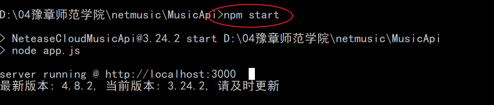
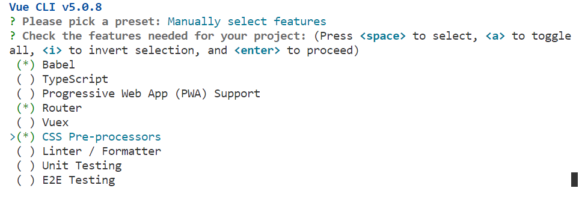
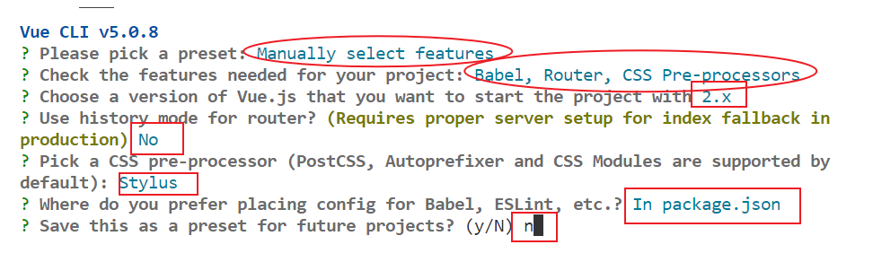
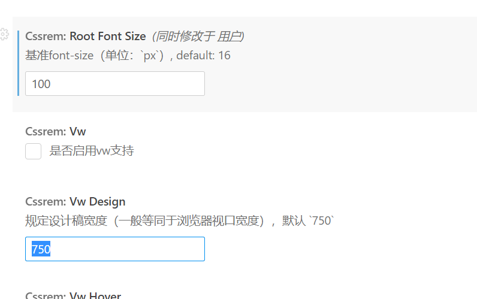
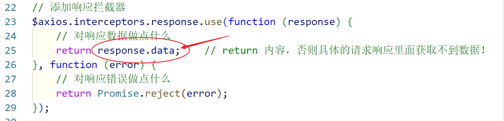
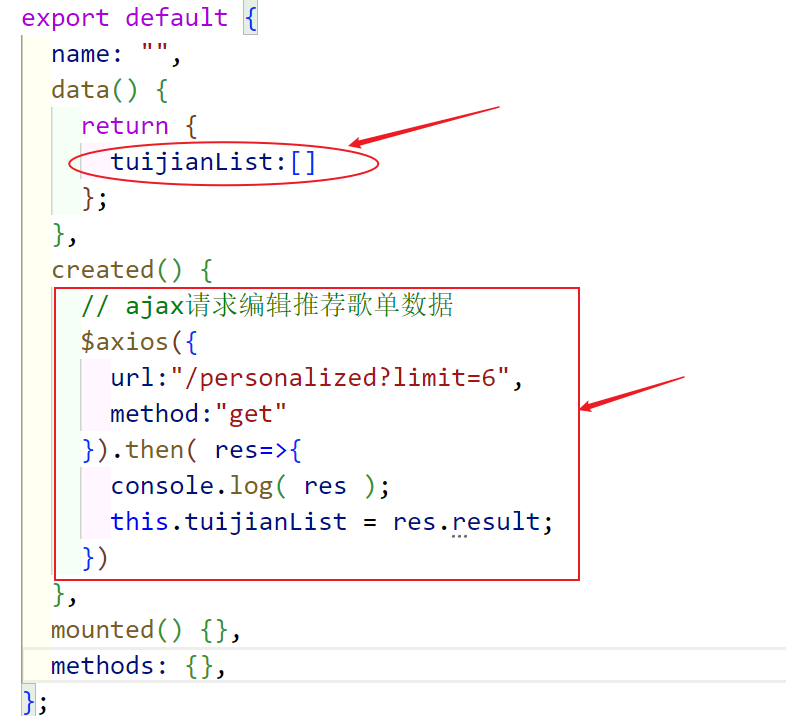
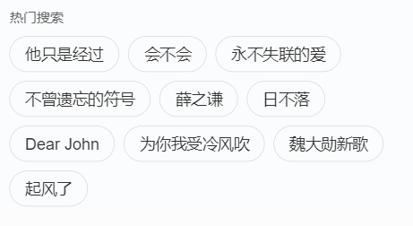
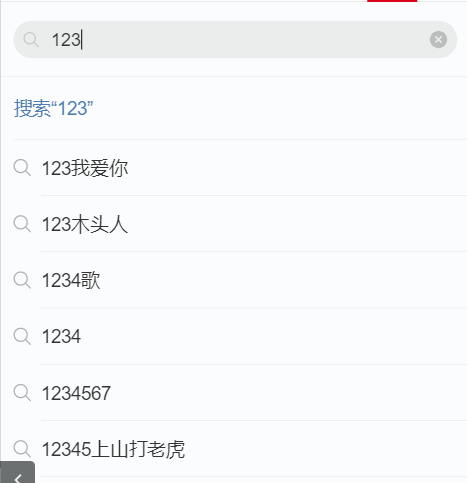
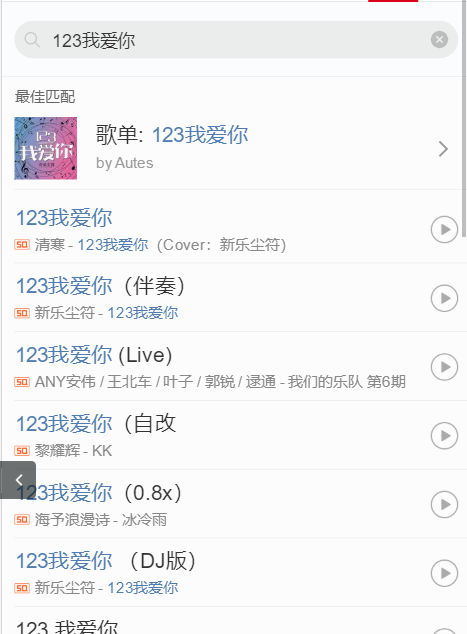
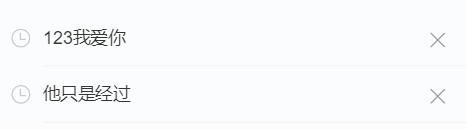

## 一、后台接口运行搭建

解压老师发的 musicApi.rar压缩包，然后进入项目的目录命令行，执行 npm  i 安装所有的依赖包。

然后执行 npm start 即可启动项目



启动成功后，即可提供所有的接口服务。注意，项目期间此服务不能中断。

接口文档：https://binaryify.github.io/NeteaseCloudMusicApi/#/ 


## 二、网页云音乐端项目搭建

### 2.1 使用 vue脚手架创建项目






### 2.2 目录配置

1） 删除无用的实例文件

​	删除assets目录下的logo.jpg

​	删除 components目录下的vue文件

​	删除views目录

​	删除app.vue中的多余代码

​	删除 router/index.js中多余的代码

2） 将移动端的手机适配js 和 css 拷贝至 assets 目录下。

​		rem.js  和 reset.css

​	 安装 px 转换 rem 的插件，点击 图标，完成以下修改：



## 三、项目全局配置

#### 3.1在main.js中引入reset.css  和 rem.js

```js
// 引入reset.css, 重置所有html标签的属性，在不同的浏览器中显示效果一致
import "./assets/reset.css";
// 引入rem.js，让页面根据不同的手机屏幕尺寸自动缩放
import "./assets/rem.js";
```

#### 3.2  安装axios并配置

- 安装：

  ```js
  npm i axios --save 
  ```

- 创建一个js文件。 这个JS文件中进行axios的相关配置

- 创建`common/http.js`配置axios

  - 创建实例
  - 配置拦截器

  ```js
  // 配置axios相关信息
  
  import axios from "axios";
  
  let $axios = axios.create({
      baseURL:"",
      timeout:3000
  })
  
  // 配置拦截器
  // 拦截器需要配置 axios使用 之前！
  // 添加请求拦截器
  $axios.interceptors.request.use(function (config) {
      // 在发送请求之前做些什么
      return config;   // 一定要return config ，否则 请求无法成功！
  }, function (error) {
      // 对请求错误做些什么
      return Promise.reject(error);
  });
  
  // 添加响应拦截器
  $axios.interceptors.response.use(function (response) {
      // 对响应数据做点什么
      return response;    // return 内容，否则具体的请求响应里面获取不到数据！
  }, function (error) {
      // 对响应错误做点什么
      return Promise.reject(error);
  });
  
  // 暴露出去！
  export default $axios;
  ```

- 以后在其他组件中要使用axios，导入该模块即可

- ```
  import $axios from "./common/http.js"
  ```

  

#### 3.3 跨域问题及解决

​	在浏览器中的网页如果使用 ajax 请求另一个网页，当出现不同源时就会产生跨域。所 谓同源（即指在同一个域）就是两个页面具有相同的协议（protocol），主机（host）和端 口号（port）。言外之意：当使用 Ajax 请求 url 时，如果协议、域名、端口三者之间任意 一个与当前页面 url 不同即为跨域：

| **当前页面 url**         | **被请求页面 url**       | **是否跨域** | **原因**                 |
| ------------------------ | ------------------------ | ------------ | ------------------------ |
| http://www.ujiuye.com    | http://www.ujiuye.com/a  | 否           | 同源                     |
| http://www.ujiuye.com    | https://www.ujiuye.com/a | 跨域         | 协议不同（http/https）   |
| http://www.ujiuye.com    | http://www.offcn.com     | 跨域         | 主域名不同(ujiuye/offcn) |
| http://www.ujiuye.com    | http://xue.ujiuye.com    | 跨域         | 子域名不同(www/xue)      |
| http://www.ujiuye.com:88 | http://www.ujiuye.com:77 | 跨域         | 端口不同（88/77）        |

#### 解决跨域问题：

`注意：开发阶段的跨域前端自己解决，生产环境的跨域后端解决`

vue的配置文档：https://cli.vuejs.org/zh/config

创建一个vue的全局配置vue.config.js文件（这里面写node的语法），一定要和package.json同级才生效


#### 1、方式一

修改根目录下vue.config.js

```js
// 把你封装的所有配置文件全部导出去
module.exports = {
    // publicPath 可以根据你不同的环境去配置它的初始地址，一般不会修改我们就'/'
    // outputDir  输出目录，用于打包。执行npm run build 默认生成dist文件夹，如果你想要修改成其他文件夹名就直接设置type类型
    
    // devServer 本地开发服务配置
    devServer:{
        // 设置你的代理地址（这里写后端服务器的地址）
        // 以后前端访问服务器地址时，前面直接写 /
        // 后端地址本来是：http://localhost:3000/api/getbanner
        // 会换成：http://localhost:8080/api/getbanner
        // 这样就没有跨域问题了
        // proxy即代理
        proxy: 'http://localhost:3000'
    }
}
```

注意：配置文件一旦修改必须要**重启（前端）**

#### 2、方式二

​	后端代码实现跨域


## 四、首页制作


#### 4.1， 新建pages/index.vue文件

#### 4.3 实现首页推荐音乐部分

首先实现静态页面和css , 参考案例

实现ajax接口请求并渲染。

##### 1） 修改common/http.js ， 将返回的json处理一下，避免过深的层级。

 

​	

##### 2、 在 music01.vue 中发起ajax请求并渲染页面



 将 tuijianList数组渲染到页面上

```html
    <!-- 编辑推荐部分 -->
    <div class="tuijian">
      <h2>编辑推荐</h2>
      <div class="gedanWrap">
        <ul>
          <li v-for="(item,index) in tuijianList" :key="index">
            <span class="music musicicon">{{ item.playCount }}</span>
            
            <p>{{ item.name }}</p>
          </li>
        </ul>
      </div>
    </div>
```

 11月16日上午完成部分：


在data中增加数据zuixinList ,默认为空数组


ajax请求：

```
    // ajax请求最新音乐列表数据
    $axios({
      url:"/top/song?type=0",
      method:"get"
    }).then( res=>{
      console.log( res );
      // 接口默认返回100条数据，但页面上只需要渲染10条
      this.zuixinList = res.data.splice(0,10)
    })
```


开始遍历zuixinList数组渲染页面

```html
          <li v-for="(item,index) in zuixinList" :key="index">
            <div class="zuixinLeft">
              <p class="p1">{{ item.name }} <span style="color:#666"> {{ item.alias | musicTilte }}</span></p>
              <p class="p2">{{ item.artists | artName }}-{{ item.name }}</p>
            </div>
            <div class="zuixinRight">
              <span class="player"></span>
            </div>
          </li>
```


注意 ，歌曲的副标题alias为数组，因此我们定义了过滤器处理该数组：

```js
// filter() 过滤器，参数1过滤器名字，参数2为处理函数，函数中的形参为模板中竖线前的数据
Vue.filter("musicTilte",function(val) {
  let str = "";
  if( val.length >0 ){
    str += "(" + val[0] + ")"
  }
  return  str 
})
```

过滤器在模板中的使用：


另外 歌手字段artists也是数组，也需要使用过滤器处理。

```js
Vue.filter('artName', function (val) {
  let str = "";
  for(let item of val){
    str += item.name + " / "
  }
  return str;
})
```


#### 3)  热歌榜部分渲染


## 五、搜索

切换到搜索页面后，共有三个内容部分：

### 1）默认的搜索热词列表



### 2）用户输入的关键词搜索结果列表



### 3） 根据关键词搜索后的歌单列表



### 4） 搜索历史关键词列表





### 5) 根据关键词搜索结果渲染页面

​	5.1） 在list01.vue中ajax请求默认的前10搜索热词并渲染页面。

​	5.2）  在music03.vue中，给input使用v-model绑定数据keyword。然后使用侦听器监听input中用户输入的关键词，如果数据变化就发送ajax请求该关键词的搜索结果。

```js
  // 侦听器，监听data中某个数据的变换，并自动调用处理函数
  watch:{
    keyword(newVal,oldVal){
      console.log("变换后的内容是："+newVal);
      // 如果变化后的内容是空字符串，则不发送ajax请求
      if( !newVal ){
        return;
      }
      // 获取到用户输入的关键词后，发送ajax请求该词的搜索结果
      $axios({
        url:"/search?keywords="+newVal,
        method:"get"
      }).then(res=>{
        // console.log( res );
        this.keywordList = res.result.songs.splice(0,10)
        console.log( this.keywordList );
      })
    }
  },
```

​	将搜索结果数据传递给 list02.vue 子组件中，使用父子组件通信

```html
<list02 :keyword="keyword" :keywordList="keywordList" v-if="flag==1"></list02>
```

 在子组件找那个接收数据，并渲染页面

```js
props:["keyword","keywordList"],
```

```html
  <section class="m-recom">
    <h3 class="title f-bd f-bd-btm f-thide">搜索“{{keyword}}”</h3>
    <ul>
      <li v-for="(item,index) in keywordList" :key="index" class="recomitem">
        <i class="u-svg u-svg-search"></i>
        <span class="f-bd f-bd-btm f-thide">{{ item.name }}</span>
      </li>
```


#### 6）点击关键词，查询关键词的数据并渲染歌单列表

给list01.vue中的所有的关键词绑定点击事件，然后修改父组件中的keyword数据，然后父组件中监听器监听到keyword变换后，自动去ajax请求搜索接口。

给所有的关键词绑定事件，点击可获取当前的关键词

```html
<li @click="fn(item.first)" v-for="(item,index) in hotList" :key="index" class="item f-bd f-bd-full">
          <a class="link" href="javascript:void(0);">{{ item.first }}</a>
</li>
```

点击处理函数实现：

```js
    fn(keyword){
      console.log( keyword );
      // 根据获取的关键词发送ajax请求，并渲染页面
      // 思路1： list01.vue中获取的关键词发送ajax返回数据，要在list03.vue中渲染，这样不容易实现，不推荐
      // 思路2：修改父组件中的keyword，然后让父组件去发送ajax返回数据，然后再发送数据给list03.vue中渲染
      console.log( this.$parent );
      this.$parent.keyword = keyword;
      // 修改父组件中的flag变量,从而显示歌单组件list03.vue
      this.$parent.flag=2;  
    }
```


然后，父组件music03.vue需要将返回的搜索结果数据传递给子组件list03.vue进行渲染。

```html
<list03 :keywordList="keywordList" v-if="flag==2"></list03>
```

最后，在list03.vue中使用 props接收keywordList数据并渲染页面。

```
  props:['keywordList'],
```

```html
      <ul>
        <li v-for="(item, index) in keywordList" :key="index">
          <div class="zuixinLeft">
            <p class="p1">
              {{ item.name }}
              <span style="color: #666">{{ item.alias | musicTilte }}</span>
            </p>
            <p class="p2">{{ item.artists | artName }}-{{ item.name }}</p>
          </div>
          <div class="zuixinRight">
            <span class="player"></span>
          </div>
        </li>
      </ul>
```


#### 7）根据用户输入的关键词渲染歌单列表

在list02.vue中绑定事件，获取用户输入的关键词的联想结果

```
      <li @click="fn(item.name)" v-for="(item,index) in keywordList" :key="index" class="recomitem">
        <i class="u-svg u-svg-search"></i>
        <span class="f-bd f-bd-btm f-thide">{{ item.name }}</span>
      </li>
```

实现fn函数：

```js
    fn(word){
      console.log( word );
      // 修改父元素中keyword关键词
      this.$parent.keyword = word;
      // 修改父元素中flag,显示歌单列表
      this.$parent.flag = 2;
    }
```


#### 8） 跳转到音乐播放页

新建 pages/song.vue 页面组件，专门实现播放音乐。

在 router/index.js中新增一条路由，能实现跳转到音乐页面组件

```js
const routes = [
  {path:"/", redirect:"/index"},
  {path:"/index", component:index},
  {path:"/song",component:song}
]
```

要实现页面的跳转，两种方法：

#### a）使用 router-link 标签

例：在要点击跳转的html标签外添加 <router-link>

```html
          <li v-for="(item,index) in zuixinList" :key="index">
           <router-link :to="'/song?id='+item.id">
            <div class="zuixinLeft">
              <p class="p1">{{ item.name }} <span style="color:#666;">{{ item.alias | musicTilte }}</span> </p>
              <p class="p2">{{ item.artists | artName }}-{{ item.name }}</p>
            </div>
            <div class="zuixinRight">
              <span class="player"></span>
            </div>
			</router-link>
          </li>
```

#### b) 添加点击事件，使用 $router.push() 实现编程跳转

```html
<li @click="gosong(item.id)" v-for="(item,index) in zuixinList" :key="index">
```

在methods中实现gosong函数：

```js
  methods: {
    gosong(id){
      // 跳转到音乐播放页面
      this.$router.push("/song?id="+id)
    }
  },
```


#### 9) 实现音乐播放

跳转到音乐播放页后，可使用 this.$route.query 获取音乐的id号，并且根据id发送ajax请求获取该音乐的播放地址。并且将mp3播放地址绑定到 audio标签上的src属性上。

```js
    created() {
      // 获取到要播放的音乐的id
      let id = this.$route.query.id;
      console.log( this.$route );
      $axios({
        url:"/song/url/v1?id="+id
      }).then( res=>{
        console.log( res );
        this.mp3url = res.data[0].url;
      })
    },
```

```js
<audio :src="mp3url" ref="musicplay" controls></audio>
```

实现编程控制音乐播放和暂停。首先给audio标签添加 ref 属性，属性值用户自定义，可以在程序中使用 this.$refs对象或控制页面中html元素。

```js
      play(){
        // let bb = document.getElementById("bbb")
        // bbb.paly()
        console.log( this.$refs );
        this.$refs.musicplay.play()
      },
      pause(){
        this.$refs.musicplay.pause()
      }
```

