# CSS3 弹性布局

CSS3引入了一种新的布局模式——**Flexbox布局**，即伸缩布局盒模型也叫**弹性布局**（Flexible Box），用来提供一个更加有效的方式制定、调整和分布一个容器里项目布局，即使它们的大小是未知或者动态的，这里简称为**Flex**。

布局的传统解决方案，基于盒状模型，依赖display属性+position属性+float属性。它对于那些特殊布局非常不方便，比如垂直居中就不容易实现。

2009年，W3C提出了一种新的方案—-Flex布局，可以简便、完整、响应式地实现各种页面布局。目前，它已经得到了所有浏览器的支持。

## 一、Flex布局

Flex是Flexible Box的缩写，意为”弹性布局”，用来为盒状模型提供最大的灵活性。

**任何一个容器都可以指定为Flex布局。**

```css
display: flex;
```

**行内元素也可以使用Flex布局。**

```css
display: inline-flex;
```

Webkit内核的浏览器，必须加上-webkit前缀。

**注意：设为Flex布局以后，子元素的float、clear和vertical-align，绝对定位将失效。**

## 二、基本概念

采用Flex布局的元素，称为Flex容器（flex container），简称”容器”。它的所有子元素自动成为容器成员，称为Flex项目（flex item），简称”项目”。

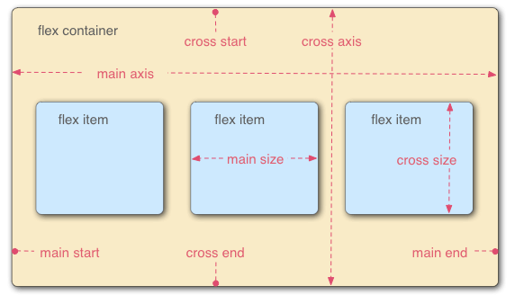

容器默认存在两根轴：水平的主轴（main axis）和垂直的交叉轴（cross axis）。主轴的开始位置（与边框的交叉点）叫做main start，结束位置叫做main end；交叉轴的开始位置叫做cross start，结束位置叫做cross end。

**项目默认沿主轴排列**。单个项目占据的主轴空间叫做main size，占据的交叉轴空间叫做cross size。

## 三、容器的属性

以下6个属性设置在容器上。

### 1. flex-direction属性

flex-direction属性决定主轴的方向（即项目的排列方向）。

```css
.box {
  flex-direction: row | row-reverse | column | column-reverse;
}
```

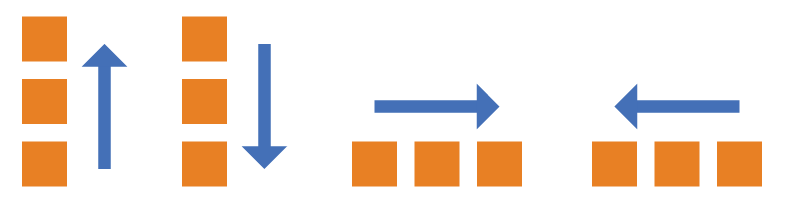

取值说明：

row：默认值，主轴为水平方向，起点在左端。

row-reverse：主轴为水平方向，起点在右端。

column：主轴为垂直方向，起点在上沿。

column-reverse：主轴为垂直方向，起点在下沿。

### 2. flex-wrap属性

默认情况下，项目都排在一条线（又称”轴线”）上。flex-wrap属性定义，如果一条轴线排不下，如何换行。

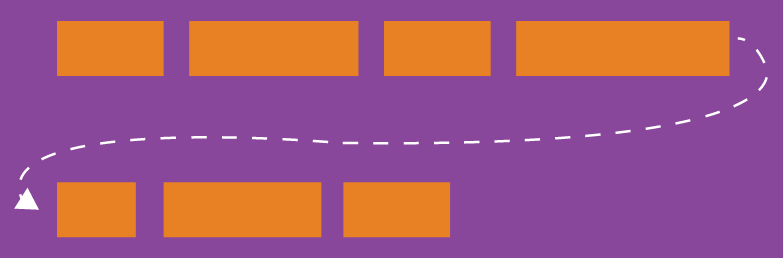

```css
.box{
  flex-wrap: nowrap | wrap | wrap-reverse;
}
```

它可能取三个值。

（1）nowrap(默认)：不换行。

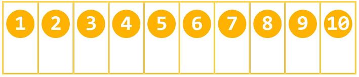

（2）wrap：换行，第一行在上方。

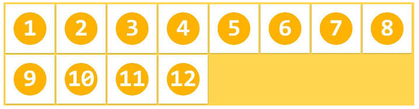

（3）wrap-reverse：换行，第一行在下方。

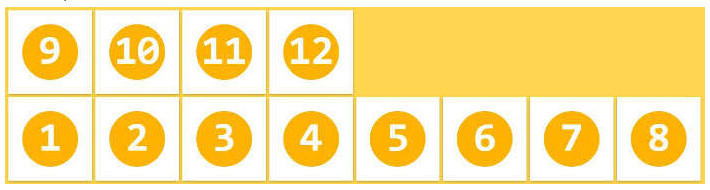

### 3. flex-flow属性

flex-flow属性是flex-direction属性和flex-wrap属性的简写形式，默认值是row nowrap.

```css
.box {
  flex-flow: <flex-direction> <flex-wrap>;
}
```

### 4. justify-content属性 ***

justify-content属性定义了项目在主轴上的对齐方式。

```css
.box {
  justify-content: flex-start | flex-end | center | space-between | space-around;
}
```

它能取5个值，具体对齐方式与轴的方向有关。下面假设主轴为从左到右。

flex-start：默认值，左对齐。

flex-end：右对齐。

center：居中。

space-between：两端对齐，项目之间的间隔都相等。

space-around：每个项目两侧的间隔相等。所以，项目之间的间隔比项目与边框的间隔大一倍。

效果图如下：

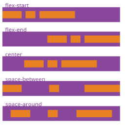

### 5. align-items属性***

align-items属性定义项目在交叉轴上如何对齐。

```css
.box {
  align-items: flex-start | flex-end | center | baseline | stretch;
}
```

它可能取5个值。具体的对齐方式与交叉轴的方向有关，下面假设交叉轴从上到下。

flex-start：交叉轴的起点对齐。

flex-end：交叉轴的终点对齐。

center：交叉轴的中点对齐。

baseline：项目的第一行文字的基线对齐。

stretch：默认值，**如果项目未设置高度或者设为auto,将占满整个容器的高度**。

效果图如下：


### 6. align-content属性

align-content属性定义了多根轴线的对齐方式。如果项目只有一根轴线，该属性不起作用。

**条件：必须对父元素设置属性display:flex，并且设置换行flex-wrap:wrap，这样这个属性的设置才会起作用**

```css
.box {
  align-content: flex-start | flex-end | center | space-between | space-around | stretch;
}
```

该属性可能取6个值。

flex-start：与交叉轴的起点对齐

flex-end：与交叉轴的终点对齐

center：与交叉轴的中点对齐

space-between：与交叉轴两端对齐，轴线之间的间隔平均分布

space-around：每根轴线两侧的间隔都相等。所以，轴线之间的间隔比轴线与边框的间隔大一倍

stretch：默认值，轴线占满整个交叉轴

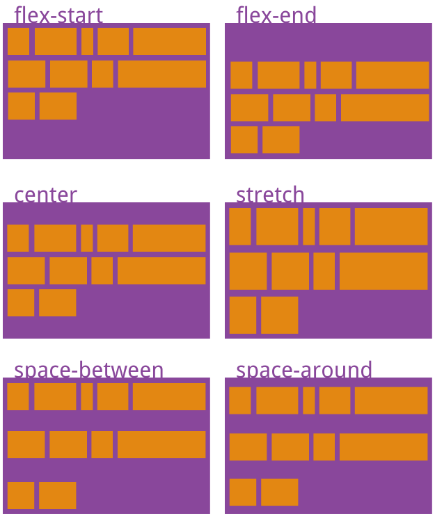

## 四、项目（子元素）的属性

以下6个属性设置在子元素上。

### 1. order属性

order属性定义子元素的排列顺序。数值越小，排列越靠前，默认为0。

```
.item {
  order: <integer>;
}
```

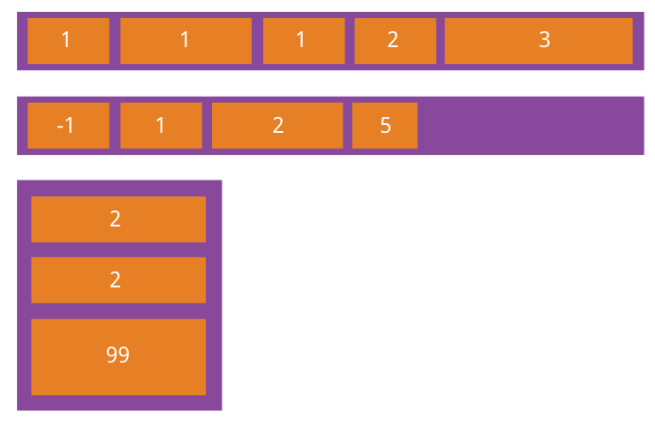

### 2. flex-grow属性

flex-grow属性定义子元素的放大比例，默认为0，即如果存在剩余空间，也不放大。

```css
.item {
  flex-grow: <number>; /* default 0 */
}
```

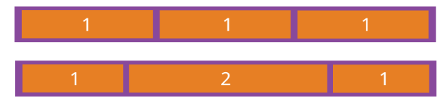

如果所有子元素的flex-grow属性都为1，则它们将等分剩余空间（如果有的话）。如果一个子元素的flex-grow属性为2，其他子元素都为1，则前者占据的剩余空间将比其他项多一倍。

### 3.  flex-shrink属性

flex-shrink属性定义了子元素的缩小比例，默认为1，即如果空间不足，子元素将缩小。

```
.item {
  flex-shrink: <number>; /* 默认 1 ，倍数*/
}
```

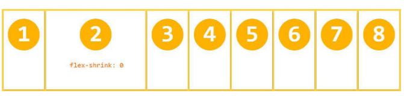

### 4.  flex-basis属性

flex-basis属性定义了在按比例分配父元素的剩余空间。浏览器根据这个属性，计算主轴是否有多余空间。它的默认值为auto，即子元素的本来大小。

```
.item {
  flex-basis: <length> | auto; /* 默认 auto */
}
```

它可以设为跟width或height属性一样的值（比如350px），则子元素将占据固定空间。

### 5.  flex属性

flex属性是flex-grow, flex-shrink 和 flex-basis的简写，默认值为0 1 auto。后两个属性可选。

```
.item {
  flex: none | [ <'flex-grow'> <'flex-shrink'>? || <'flex-basis'> ]
}
```

该属性有两个快捷值：auto (1 1 auto) 和 none (0 0 auto)。

建议优先使用这个属性，而不是单独写三个分离的属性，因为浏览器会推算相关值。

### 6.  align-self属性

align-self属性允许单个子元素有与其他子元素不一样的对齐方式，可覆盖align-items属性。默认值为auto，表示继承父元素的align-items属性，如果没有父元素，则等同于stretch。

```
.item {
  align-self: auto | flex-start | flex-end | center | baseline | stretch;
}
```

该属性可能取6个值，除了auto，其他都与align-items属性完全一致。

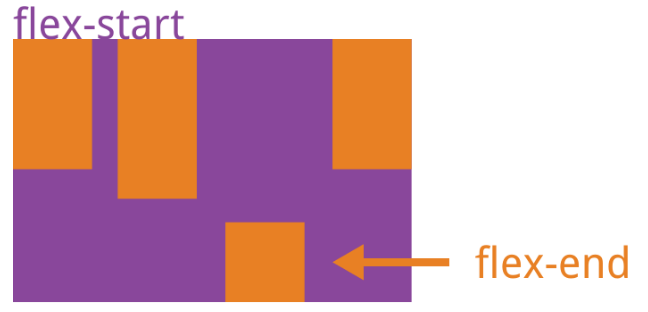


​                               
