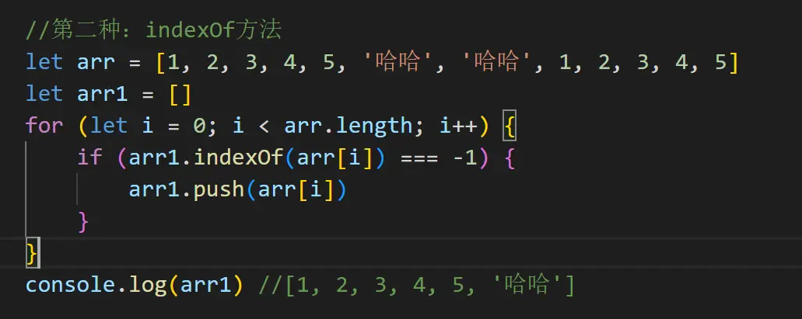

### 第一种：Set()方法

Set本身是一个[构造函数](https://links.jianshu.com/go?to=https%3A%2F%2Fso.csdn.net%2Fso%2Fsearch%3Fq%3D%E6%9E%84%E9%80%A0%E5%87%BD%E6%95%B0%26spm%3D1001.2101.3001.7020)，用来生成Set数据结构。

它类似于[数组](https://links.jianshu.com/go?to=https%3A%2F%2Fso.csdn.net%2Fso%2Fsearch%3Fq%3D%E6%95%B0%E7%BB%84%26spm%3D1001.2101.3001.7020)，但里面的成员是唯一的，不重复的。

### 第二种：indexOf()

indexOf()的意思：查找一个字符串中，第一次出现指定字符串的位置。

[indexOf](https://links.jianshu.com/go?to=https%3A%2F%2Fso.csdn.net%2Fso%2Fsearch%3Fq%3DindexOf%26spm%3D1001.2101.3001.7020)方法返回一个整数值，指出 string对象内子字符串的开始位置。如果没有找到该字符串则返回-1。

### 第三种：includes 方法

includes 方法会找到某一数组是否包含某元素  返回一个[布尔](https://links.jianshu.com/go?to=https%3A%2F%2Fso.csdn.net%2Fso%2Fsearch%3Fq%3D%E5%B8%83%E5%B0%94%26spm%3D1001.2101.3001.7020)值

includes 也可以用来查询字符串中是否包含某一个元素  返回的也是一个布尔值

###  第四种：slice方法去重

​    Array.slice() 截取数组，将截取到的数组返回，不改变原数组。

​    slice(num1,num2)方法可以传入两个参数（二者均为数组的下标）

​    num1:开始截取数组的位置（包含该位置的元素）

​    num2:停止截取数组的位置（不包含该位置的元素），不传，则默认值是数组的长度length。

(1)对象去重

（2）数组去重

### 第五种：双重for循环

### 第六种：filter与indexOf结合

filter() 方法创建一个新的数组，新数组中的元素是通过检查指定数组中符合条件的所有元素。

### 第七种：map方法 

map是js中的一种[数据结构](https://links.jianshu.com/go?to=https%3A%2F%2Fso.csdn.net%2Fso%2Fsearch%3Fq%3D%E6%95%B0%E6%8D%AE%E7%BB%93%E6%9E%84%26spm%3D1001.2101.3001.7020)，允许存储键、值对，键和值可以是任意类型的数据，如果其中存在的键，值会被替换

map()方法：返回一个新[数组](https://links.jianshu.com/go?to=https%3A%2F%2Fso.csdn.net%2Fso%2Fsearch%3Fq%3D%E6%95%B0%E7%BB%84%26spm%3D1001.2101.3001.7020)，不会修改原数组，且不会对空数组进行检测。

**Map中的一些常用方法**

1、has()：检测map对象中键是否存在，存在返回true，不存在返回false。

2、set()：为map对象添加键值对，方法里里面跟两个参数（键，值），如果只传入一个参数，则值为undefine。

3、get()：通过键来获取对应的值。

### 第八种：reduce方法 

 reduce()方法不仅仅用于数组求和，还可以满足增删查改、去重、平铺数组等需求，当reduce()方法解决每层数组的迭代拼接时，就会起到去重的作用。

​    prev：表示上一次调用回调时的返回值，或者初始值 init;

​    cur：表示当前正在处理的数组元素；

​    index：表示当前正在处理的数组元素的索引，若提供 init 值，则索引为0，否则索引为1；

​    init：表示初始值。

​    arr：表示原数组；

作者：srchafreen
链接：https://www.jianshu.com/p/e1bea0039f16
来源：简书
著作权归作者所有。商业转载请联系作者获得授权，非商业转载请注明出处。