## 1、组件基础

### 1.1、组件介绍

- 组件： 组成整体的部分零件。 网页开发中的组件的含义，具有独立功能的模块（HTML，CSS，JS）。
- 网页中一切皆为组件： 大到一个页面，中到一个模块，小到一个标签都是组件！
- 组件化开发：
  - 组件使用来复用， 提高开发效率！
  - 维护容易！
- vue两大特点：
  - 数据驱动 （双向数据绑定）
  - 组件化

### 1.2、组件注册

#### 1.2.1非单文件组件

##### 1.2.1.1使用步骤

- 定义组件
- 注册组件
- 使用组件

##### 1.2.1.2定义组件

使用使用Vue.extend(options)创建,其中options和Vue(options)时传入的几乎一样,但区别如下:

1. el不要写,为什么? ----最终所有的组件都要经过一个vm的管理,由vm中的el决定服务器哪个容器
2. data必须写成函数,为什么? ---避免组件被复用时,数据存在引用关系

> 使用template可以配置组件结构

##### 1.2.1.3注册组件

- 全局注册（整站点内任意调用）

  ```js
  Vue.component('组件名',{ 配置选项 })
  ```

- 局部注册（只能在父组件中调用）

  ```js
     new Vue({
          ...,
          components:{
              组件名1,
              组件名2
          }
      })
  ```

- 注意：

  - 组件命名：
    - 一个单词组成
      - 首字母小写:school
      - 首字母大写:School
    - 多个单词组成
      - my-school
      - MySchoool(需要vue脚手架)
    - 组件名尽可能回避HTML已有元素名称
    - 可以使用name配置项指定组件在开发者工具中呈现的名字
  - 组件标签
    
    - <school></school>
    - <school/>
    - 不用脚手架时,<school/>会导致后续组件不能渲染
  - 简写方式
    
    - ```
      const school = Vue.extend(options)可以简写为const school = option
      ```

##### 1.2.1.4使用组件

```js
<school></school>
```

```js

<body>
    <div id="root">
        <!-- 3编写组件标签 -->
        <school></school>
        <hr>
        <stu></stu>
        <hr>
    </div>
    <div id="root2">
        <stu></stu>        <stu></stu>
    </div>
</body>
<script>
    Vue.config.productionTip = false //阻止vue启动时生成生产提示
    //1创建school组件
    const school = Vue.extend({
        template:`
            <div>
                <h2>学校名称{{name}}</h2>
                <h2>学校地址{{address}}</h2>   
                <button @click="showname">点我提示学校名</button> 
            </div>
        `,
        data() {
            return {
                    name: '首义',
                    address: '武汉'
            }
        },
        methods:{
            showname(){
                alert(this.name)
            }
        }
    })
    //创建school组件
    const stu = Vue.extend({
        template:`
            <div>
                <h2>学生姓名{{name}}</h2>
                <h2>学生年龄{{age}}</h2>    
            </div>
        `,
        data() {
            return {
                    name: '薛屹阳',
                    age: 22
            }
        },
    })
    // 全局注册
    Vue.component('stu',stu)
     new Vue({
        el: '#root',
        data:{
            msg:'哈哈哈哈哈'
        },
        // 2注册局部组件
        components:{
            school,stu
        }
    })
    new Vue({
        el:'#root2',
    })
</script>
```

### 1.3、组件嵌套（了解）

- **全局组件，任何组件的模板里面都可以使用！**
- **局部组件，只能出现在自己的父模板里面！**     子组件中的数据、方法等父组件也不能直接使用，反之亦然。

```html

<body>
    <div id="root">
        <h2></h2>
    </div>
</body>
<script>
    Vue.config.productionTip = false //阻止vue启动时生成生产提示
    const bbb = Vue.extend({
        template: `
        <div>
            <h1>{{name}}</h1>
            <h1>{{age}}</h1>
        </div>
        `,
        data() {
            return {
                name: 'mingzi2',
                age: 112
            }
        }
    })
    const aaa = Vue.extend({
        template: `
        <div>
            <h1>{{name}}</h1>
            <h1>{{age}}</h1>
            <bbb></bbb>
        </div>
        `,
        data() {
            return {
                name: 'mingzi',
                age: 11
            }
        },
        components: {
            bbb
        }
    })
    const app = Vue.extend({
        template:`
        <div>
            <aaa></aaa>    
        </div>
        `,
        components:{
            aaa
        }
    })
    Vue.component('aaa', aaa)
    const vm = new Vue({
        el: '#root',
        template:`
        <app></app>
        `,
        data: {

        },
        components: {app}
    })
</script>
</html>
```

### 1.4、组件配置项

- template    类似  el ，组件的html模板

- components  可以注册的子组件
- **data**
  -  vue实例 data是一个对象！
  -  组件实例 data是一个函数！ 且这个函数返回一个对象！
     -  组件中的data为什么是一个函数！
        -  因为组件的模板是一样的，css样式一样的，JS处理的逻辑的一样的，但是**数据各自应该是独立的！互不干扰的！**
        -  **如果组件data是一个对象，那么所有组件就都是同一个数据源，就会出现互相干扰！**     
- methods
- created
- mounted
- computed
- watch
- ...
- 注意：
  - **在 父子组件模板中不能直接使用各自的数据或者方法！** 

### 1.5、VueComponent

1. school组件本质是一个名为VueComponent的构造函数,且不是程序员定义的,是Vue.extend生成的

2. 我们只需要写<school/>或<school><school/>,Vue解析时会帮我们创建school组件的实例对象,即Vue帮我们执行的:new VueComponent(option)

3. 关于this指向:

   1. 组件配置中:

      data函数,methods中的函数,watch中的函数,computed中的函数,他们的this指向均是VueComponent实例对象

   2. new Vue()配置中:

      data函数,methods中的函数,watch中的函数,computed中的函数,他们的this指向均是Vue实例对象

4. 特别注意:每次调用Vue.extend,返回的都是一个全新的VueComponent!!!!!

5. VueComponent的实例对象,简称vc,Vue的实例对象简称vm


### 1.6、重要的内置关系

1. Vue.Component.prototype.__ proto __===Vue.prototype
2. 为什么要有这个关系:让组件实例对象vc可以访问到Vue原型上的属性和方法

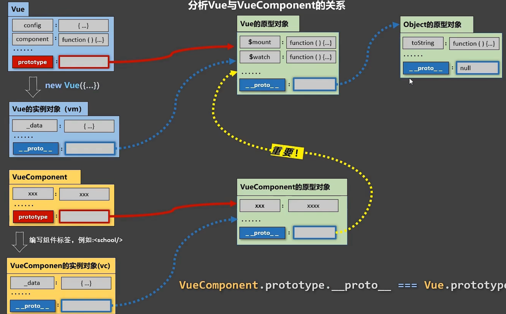

### 1.7、单文件组件

需使用脚手架

## 2、脚手架

### 2.1、脚手架含义

- 快速搭建一个项目基础的框架结构（目录结构），然后进行后继开发。


### 2.2、vue-cli介绍

- https://cli.vuejs.org/zh/guide/installation.html

- 安装vue-cli工具

  ```js
  npm i webpack -g //安装webpack
  npm i @vue/cli -g //安装vue脚手架 4.5 -2.x代码
  
  //创建项目 ：不要创建在C盘，不要创建在桌面
  vue create demo //demo是项目名称
  
  //进入项目
  cd demo 
  
  //启动
  npm run serve
  ```
  

安装过程选项配置：

注意，部分系统在会因为权限问题出现如下报错：

解决方法：

1. 先关闭vscode，再以管理员身份运行vscode;

2. 执行：get-ExecutionPolicy，显示Restricted，表示状态是禁止的;

3. 执行：set-ExecutionPolicy RemoteSigned;

4. 这时再执行get-ExecutionPolicy，就显示RemoteSigned;

原文链接：https://blog.csdn.net/larpland/article/details/101349586


### 2.3、目录介绍

```
-demo
	-node_modules 依赖包
	-public
		index.html 唯一的一个页面
	-src  你的代码
		App.vue 根组件
		main.js 入口文件
		
	.gitignore 不需要备份的文件
	babel.config.js 
	package.json 配置
	readme.md 项目说明
```


注意！！！强烈推荐将npm的下载地址替换为国内的淘宝镜像地址

在命令行内输入：

```js
npm config set registry https://registry.npmmirror.com
```

然后在执行npm安装命令


### 2.4、初始化项目

- **如何运行一个Vue项目，或者发给别人一个Vue项目**
- 发给别人：
    - 删除项目名称下的node_modules包
    - 压缩项目文件夹，将文件夹发送给他人即可
  - 运行Vue项目：
    - 找到别人发给你的项目文件，解压
    - 进入解压后文件夹的目录的cmd窗口
    - 执行  npm i 重新下载项目所依赖的包
    - 下载完成后  执行  npm run serve   启动项目到浏览器对应端口打开项目即可


### 2.5、不同版本的Vue

- vue.js与vue.runtime.xxx.js的区别
  - vue.js时完整版的Vue,包含:核心功能+模版解析器
  - Vue.runtime.xxx.js是运行版的Vue,只包含核心功能
- 因为vue.runtime.xxx.js没有模版解析器,所以不能使用template配置项,需要使用render函数接受到createelement函数去指定具体内容


### 2.6、vue.config.js配置文件

- 使用vue inspect > output.js 可以查看到Vue脚手架的默认配置
- 使用vue.config.js可以对脚手架进行个性化定制,详情:https://cli.vuejs.org/zh


## 3、组件通信

### 3.1、父给子数据:自定义属性+子props接收

- 功能:子组件接受父组件的数据或函数

- 使用：

  ```js
  // 子组件里面
  export default {
          data() {
            return {
              myage:this.age//因为vue优先读取props的数据,所有data可以引用
            }
        },
        props:['name','address','age'],//第一种方式:简单接受
        props:{
          name:String,
          age:Number,
          address:String
        },//第二种方式:限制类型接受
    		props:{
          name:{
              type:String,
              required:true,
          },
          age:{
              type:Number,
              default:99//默认值
          },
          address:{
              type:String,
              required:true
          }//第三种方式:配置类型接受:进行类型限制+默认值制定+必要性限制
  }
  <!--父组件里面-->
   <Student name="李四" address="北京" :age="12"></Student>//这样动态定义age则可以将12进行表达式计算
  ```
  
  ```vue
  <!--父组件里面-->
  <子组件  自定义属性名1="值"   :自定义属性名2="变量" />
  ```

### 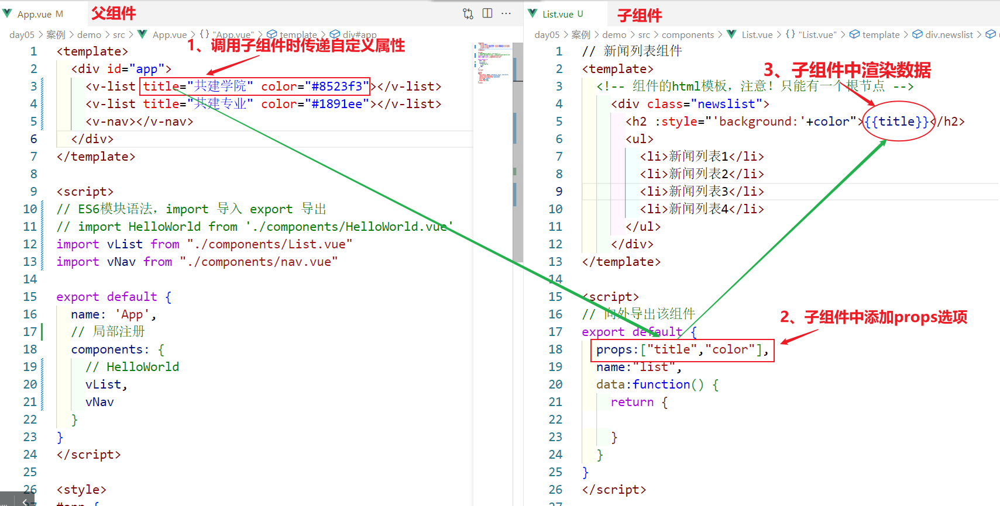3.2、子给父数据:父亲自定义事件到子vc,子直接使用不props

- 实现1： **自定义事件！**

- #### 使用  儿子先在目标位置使用并用函数,函数将向父亲获取权限,父亲用儿子的申请权限调用父亲的函数

  ```js
  // 父的模板里面
  <子组件名 @自定义事件名="父的事件函数" />
  
  // 父的JS里面
  methods:{
  		父的事件函数(形参){
  		     ....
  		}
  }
  ```

  ```js
  this.$emit("自定义事件名",实参)    // 本质调用了，父的事件函数！
  ```
  
  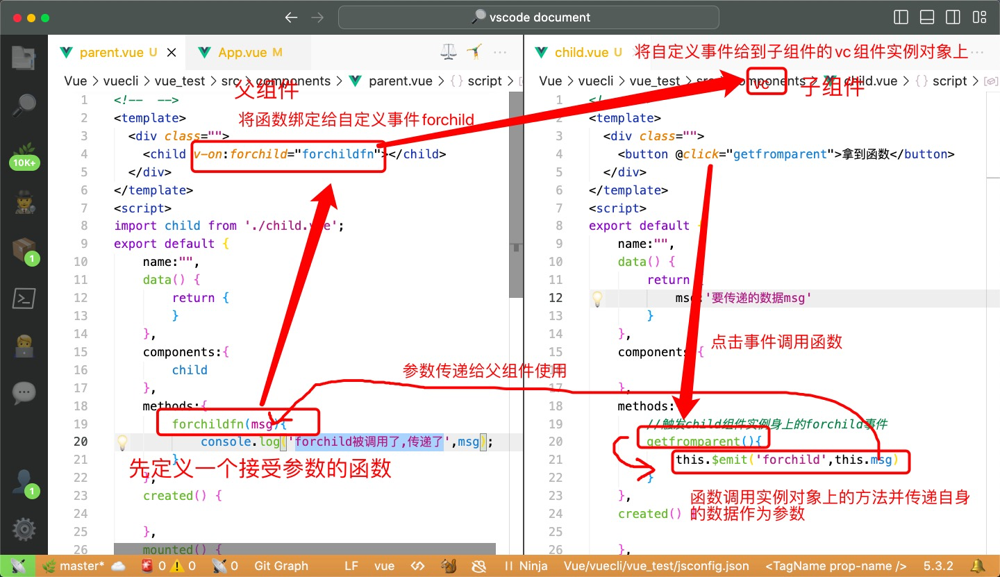

### 3.3、使用自身的属性节点|子给父数据:自定义函数+回调传数据(可以自定义拿取组件实例对象的时间等情况)

作用：在父组件中控制子组件或DOM节点

> 应用在HTML标签上获取的是真实DOM元素,应用在组件标签上是组件实例对象

实现步骤：

1、在dom节点或者在子组件上添加ref属性

```html
<h2 ref="box">父组件</h2>
<v-child ref="child" ></v-child>
```

2、在父组件程序中可以使用 $refs 对象获取DOM节点或者子组件

```js
    mounted(){
      // 1、在dom节点或者在子组件上添加ref属性
      // 2、在程序中可以使用 $refs 对象获取DOM节点或者子组件
      console.log( this.$refs );
      this.$refs.box.innerText = "大家好";//拿到 真实DOM
      // 父组件可以直接读取或修改子组件的数据，也可以直接调用子组件中的方法
      this.$refs.child.str = "今天是星期五"//拿到了Child组件的实例对象
    }
```

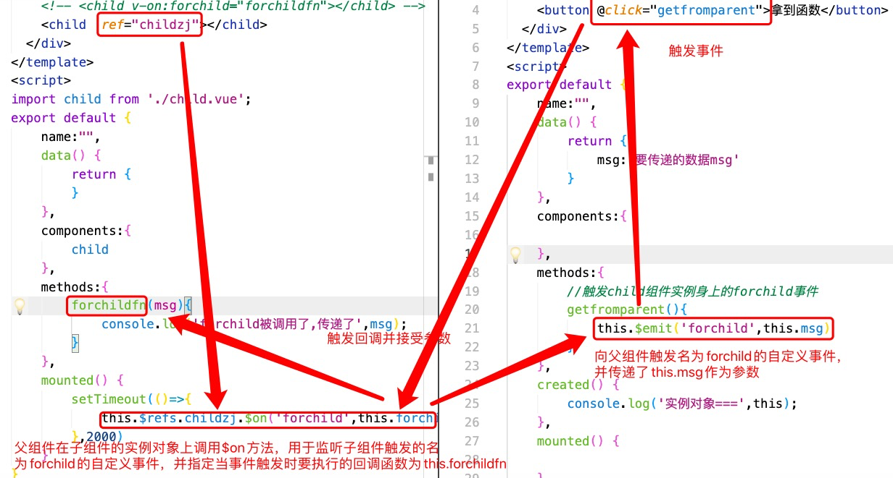

> 当子组件触发一个自定义事件时，Vue会在组件的父级链中寻找是否有对应的事件处理函数。如果找到了匹配的事件处理函数，它将被执行；如果没有找到，事件将被忽略。
>
> 因此，即使父组件中没有明确定义`forchild`事件，但是由于你在父组件中使用了`this.$refs.childzj.$on('forchild', this.forchildfn)`来监听这个事件，所以当子组件触发`forchild`事件时，父组件已经做好了准备来捕获并处理这个事件。

### 3.4、子给父数据:父亲传函数+子props接收

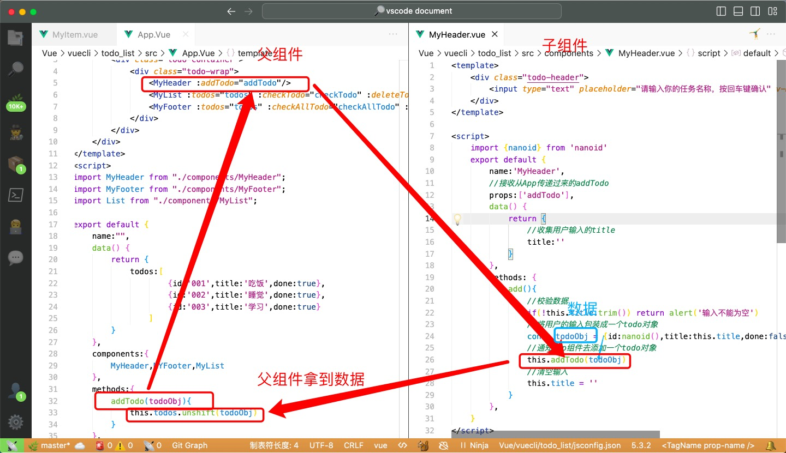

### 3.5、解绑自定义事件

```js
    methods:{
        //触发child组件实例身上的forchild事件
        getfromparent(){
            this.$emit('forchild',this.msg)
        },
        jb(){
            this.$off(['forchild'])//可解绑多个,向数组中添加即可,不写则解绑所有
        }
    },
```

### 3.6、组件自定义事件总结

1. 一种组件间通信的方式,适用于:子组件===>父组件

2. 使用场景:A是父组件,B是子组件,B想给A传输局,那么就要在A中给B绑定自定义事件(**<u>事件回调在A中</u>**)

3. 绑定自定义事件:

   1. 第一种方式:在父组件中:<Demo @xxxx="test"/>

   2. 第二种方式:在父组件中:

      ```vue
      <Demo ref='demo'/>
      .....
      mounted(){
      	this.$refs.xxx.$on('xxxx',this.test)//test为事件回调函数
      }
      ```

   3. 若想让自定义事件只触发一次,可以使用once修饰符或$once方法

4. 触发自定义事件:this.$emit('xxxx',数据)

5. 解绑自定义事件:this.$off('xxxx')

6. 组件上也可以绑定原生DOM事件,需要使用native修饰符

7. 通过this.$refs.xxx.$on('xxxx',回调)绑定自定义事件时,回调要么配置再methods中,要么用箭头函数,否则this指向会有问题

### 3.7全局事件总线(GlobalEventBus)

#### 1.原理

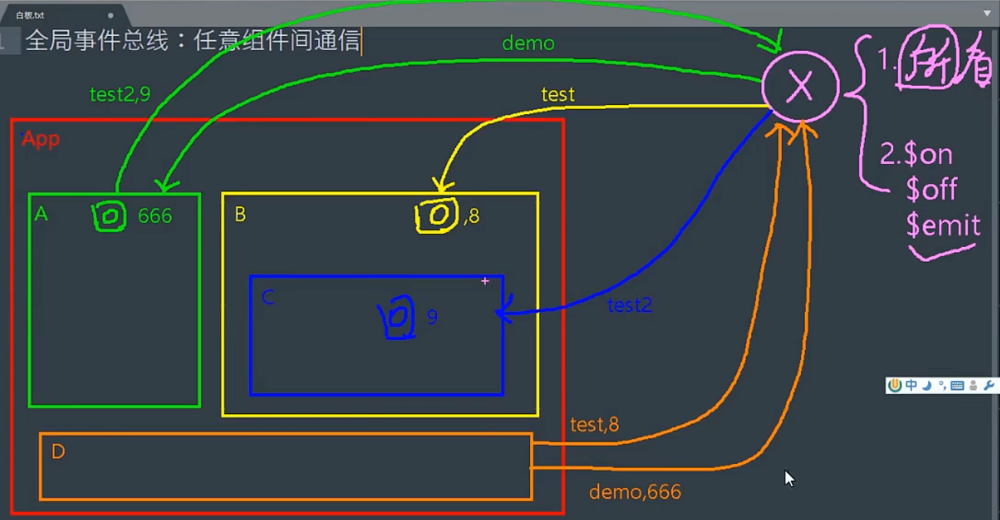

#### 2.一种组件间的通信方式,适用于任意组件间通信

#### 3.安装全局事件总线:

```vue
new Vue({
	.....
	beforeCreate(){
		Vue.prototype.$bus = this //安装全局事件总线,$bus就是当前应用的vm
	}
	.....
})
```

#### 4.使用事件总线:

1. 接受数据:A组件想接受数据,则在A组件中给$bus绑定自定义事件,事件的回调留在A组件自身

   ```vue
   methods(){
   	demo(data){...}
   .....
   	mounted(){
   		this.$bus.$on('xxxx',this.demo)
   }
   }
   ```

2. 提供数据:this.$bus.$emit('xxxx',数据)

#### 5.最好在beforeDestroy钩子中,用$off去解绑当前组件所用到的事件

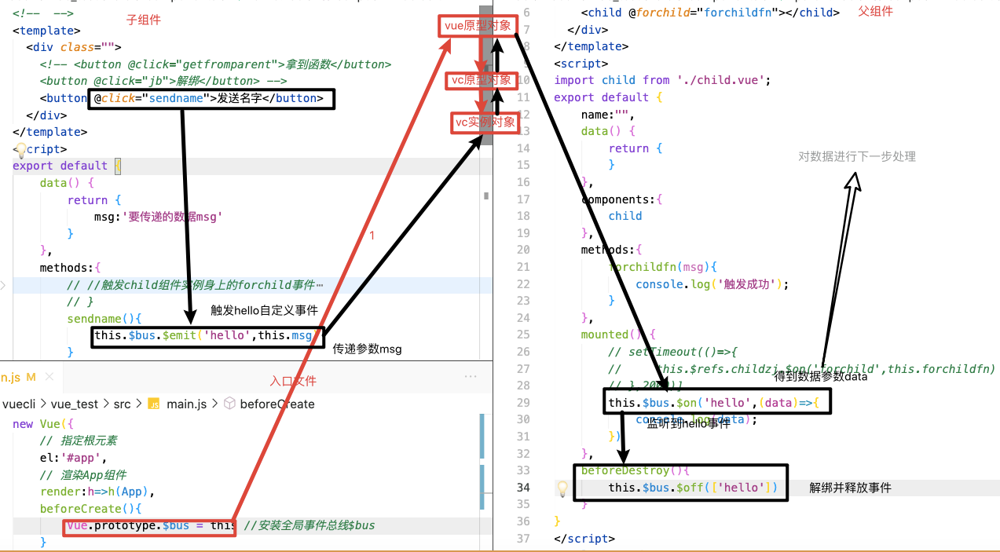

​	

------


### 3.8消息发布于订阅(pubsub)

1. ### 一种组件间通信的方式,适用于任意组件间通信

2. 使用步骤:

   1. 安装pubsub:`npm i pubsub-js`

   2. 引入:`import pubsub from 'pubsub-js'`

   3. 接受数据:A组件想接收数据,则在A组件中订阅消息,订阅的回调<u>留在A组件本身</u>

      ```vue
      method(){
      	demo(data){.....},
      }
      .....
      mounted(){
      	this.pubId = pubsub.subscribe('xxxx',this.demo)//订阅消息
      }
      ```

   4. 提供数据:`pubsub.publish('xxxx',数据)`

   5. 最好在beforeDestroy钩子中,用`  pubsub.unsubscribe(this.pubId)`去取消订阅

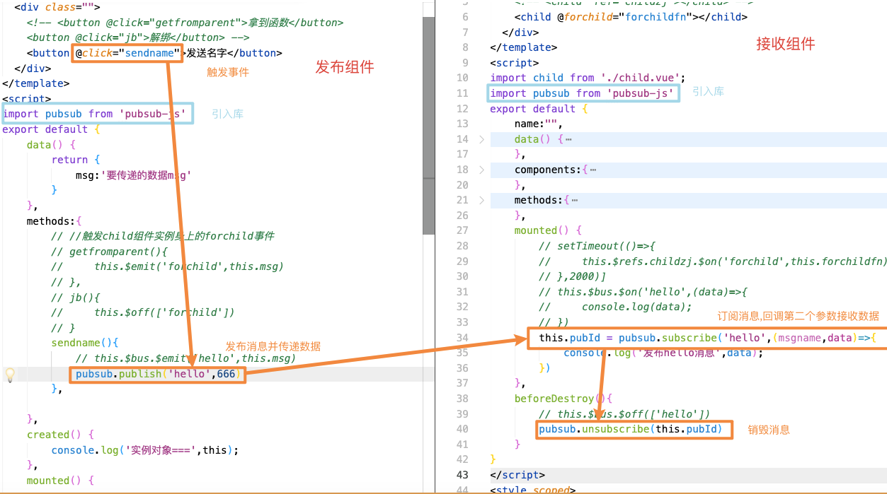

------


## 4、混入

- 功能:可以把多个组件公用的配置提取成一个混入对象

- 局部方式:

  - 定义混合,在mixin.js中

    ```js
    export const mixin = {
        methods: {
            show() {
                console.log('aaaaaa');
            }
        },
    }
    export const mixin2 ={
        data(){
            return{
                aaa:'aaa'
            }
        }
    }
    ```

  - 配置混合在所需要的子组件中,且添加配置项mixins

    ```js
    import {mixin} from '../mixin'
    import {mixin2} from '../mixin'
    
    
    export default{
      ...
       mixins:[mixin,mixin2],
      ...
    }
    ```

- 全局方式:在main.js中配置即可

    ```js
    import { mixin,mixin2 } from "./mixin.js";
    Vue.mixin(mixin)
    Vue.mixin(mixin2)
    ```
    

## 5、插件

- 功能:用于增强Vue

- 本质:包含install方法的一个对象,install的第一个参数是Vue,第二个以后的数据是插件使用者传递的数据

- 定义插件:

  - ```js
    const obj = {
        install(Vue,options){
            console.log(Vue);       
        }
    }
    export default obj
    ```

- 使用插件

  - 在main.js中

  - ```js
    Vue.use(plugins)
    ```


## 6、nextTick

1. 语法:`this.$nextTick(回调函数)`
2. 作用:在下一次DOM更新结束后执行其指定回调
3. 什么时候用:当改变数据后,要基于更新后的新DOM进行某些操作时,要在nextTick所指定的回调函数中执行


## 7、插槽

1. 作用:让父组件可以向子组件指定位置插入html结构,也是一种组件间通信的方式,适用于父组件==>子组件

2. 分类:默认插槽,具名插槽,作用域插槽

3. 使用方式:

   1. 默认插槽:

      ```vue
      父组件中:
      				<Category title="游戏" >
      					<ul>
      						<li v-for="(item, index) in games" :key="index">{{ item }}								</li>
      					</ul>
      				</Category>
      子组件中:
      				<div class="category">
             		<slot>若无内容则显示此文字</slot>
      				</div>
      ```

   2. 具名插槽

      ```vue
      父组件中:
      				<Category title="游戏" >
      					<ul slot="center">
      						<li v-for="(item, index) in games" :key="index">{{ item }}							  </li>
      					</ul>
      					//或者第二种写法
      					<template>
      						<ul v-slot:footer>
      							<li v-for="(item, index) in games" :key="index">{{ item }}							  </li>
      						</ul>
      					</template>
      				</Category>
      子组件中:
      				<div class="category">
             		<slot name="center">若无内容则显示此文字</slot>
             		<slot name="footer">若无内容则显示此文字</slot>
      				</div>
      ```

   3. 作用域插槽:

      1. 理解:数据在组件的自身,但根据数据生成的结构需要组件的使用者来决定(games数据在Category组件中,但使用数据所遍历出来的结构由App组件决定)

      2. 具体编码:

         ```vue
         // ParentComponent.vue
         <template>
           <div>
             <ChildComponent>
               <!-- 使用作用域插槽将数据传递给子组件 -->
               <template v-slot:default="slotProps">
                 <p>{{ slotProps.message }}</p>
               </template>
             </ChildComponent>
           </div>
         </template>
         
         <script>
         import ChildComponent from './ChildComponent.vue'
         
         export default {
           components: {
             ChildComponent
           }
         }
         </script>
         // ChildComponent.vue
         <template>
           <div>
             <slot :message="childMessage"></slot>
           </div>
         </template>
         
         <script>
         export default {
           data() {
             return {
               childMessage: 'Hello from child component'
             }
           }
         }
         </script>
         ```

         


## 8、TodoList案例总结

1. 组件化编码流程:
   1. 拆分静态组件:组按照**<u>功能点</u>**拆分,命名不要与HTML冲突
   2. 实现动态组件:考虑好数据的存放位置,**<u>数据</u>**是一个组件再用还是一些组件在用
      1. 一个组件在用:放在组件自身即可
      2. 一些组件在用:放在他们共同的父组件上
   3. 实现交互
2. props适用于:
   1. 父组件==>子组件通信
   2. 子组件==>父组件通信(需要通过父先给子一个函数传参)
3. 使用v-model时切记:不能是props传的值,因为props是不可修改的
4. props传过来的若是对象类型的值,修改对象中的属性时Vue不会报错,但是不推荐这么做
5. 使用计算属性时只能读取值,若要修改则需要使用set方法


## 9、Vue封装的过渡与动画

### 1.作用

在插入,更新或删除DOM元素时,在合适的时候给元素添加样式类名

### 2.图示

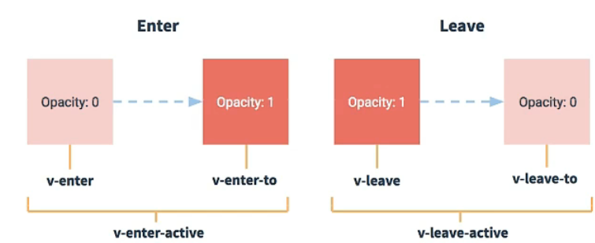

### 3.写法:

1. 准备样式:

   - 元素进入的样式:
     - v-enter:进入的起点
     - v-enter-active:进入的过程中
     - v-enter-to:进入的终点
   - 元素离开的样式:
     - v-leave:离开的起点
     - v-leave-active:离开的过程中
     - v-leave-to:离开的终点

2. 使用`<transition>`包裹要过渡的元素,并配置name属性:

   ```vue
   <transition name='hello'>
     <h1 v-show='isshow'>哈哈哈哈</h1>
   </transition>
   ```

3. 备注:若有富哦个人元素需要过渡,则需要使用:`<transition-group>`,且每个元素都要指定key值

```vue
过渡实现
<!--  -->
<template>
  <div class="">
    <button @click="isShow = !isShow">显示/隐藏</button>
    <transition-group name="aaa" appear>
        <h1 v-show="isShow" key="1" >你好</h1>
        <h1 v-show="isShow" key="2" >你好</h1>
    </transition-group>
  </div>
</template>
<script>
export default {
    name:"animation",
    data() {
        return {
            isShow:true
        }
    },
</script>
<style scoped>
h1{
    background-color: #f8b13d;
    
}

/* 进入的起点 ,离开的重点*/
.aaa-enter,.aaa-leave-to{
    transform: translateX(-100%);
}
.aaa-enter-active,.aaa-leave-active{
    transition: 1s linear;
}
/* 进入的终点,离开的起点 */
.aaa-enter-to,.aaa-leave{
    transform: translateX(0);
}
</style>
```

```vue
动画实现
<!--  -->
<template>
  <div class="">
    <button @click="isShow = !isShow">显示/隐藏</button>
    <transition name="aaa" appear>
        <h1 v-show="isShow" >你好</h1>
    </transition>
  </div>
</template>
<script>
export default {
    name:"animation",
    data() {
        return {
            isShow:true
        }
    },
</script>
<style scoped>
h1{
    background-color: #f8b13d;
}
.aaa-enter-active{
    animation: aaa 1s ;
}
.aaa-enter-active{
    animation: aaa 1s reverse;
}
@keyframes aaa {
    from{
        transform: translateX(-100%);
    }
    to{
        transform: translateX(0px);
    }
}
</style>
```

### 4.通过animation.css库实现

1. npm安装`npm i animate.css`

2. ```vue
   <!--  -->
   <template>
     <div class="">
       <button @click="isShow = !isShow">显示/隐藏</button>
       <transition-group 
       name="animate__animated animate__bounce" 
       appear
       enter-active-class="animate__swing"
       leave-active-class="animate__backOutUp"
       >
           <h1 v-show="isShow" key="1" >sdadsa</h1>
           <h1 v-show="isShow" key="2" >afsafasfsa</h1>
       </transition-group>   
     </div>
   </template>
   <script>
   import "animate.css"
   export default {
       name:"animation",
       data() {
           return {
               isShow:true
           }
       },
   }
   </script>
   <style scoped>
   h1{
       background-color: #f8b13d;   
   }
   ```


## 10、vue配置代理服务器

### 1.方法1

在vue.config.js中添加如下配置

```vue
  devServer: {
    // proxy:'http://localhost:3000'
    }
```

说明:

- 优点:配置简单,请求资源时直接发给前端即可
- 缺点:不能配置多个代理,不能灵活的控制请求是否走代理
- 工作方式:若按照上述配置代理,当请求了前端不存在的资源时,那么该请求会转发给服务器(优先匹配前端资源)

### 2.方法2

假如axios发送`axios.get('http://localhost:8080/api/account/create')`

在vue.config.js中添加如下配置

```js
module.exports = defineConfig({
  transpileDependencies: true,
  lintOnSave: false,
  devServer: {
    // proxy:'http://localhost:3000'
    proxy: {
      '/api': {//匹配所有以/api开头的请求路径
        target: 'http://localhost:3000',//要转发给的服务器地址
        // 重写路径,在服务器端去掉/api
        pathRewrite: {
          '^/api': ''
        },
        // 是否改变源地址,用于控制请求头中的host值
        changeOrigin: true,
        // 是否开启websocket
        ws: true
      },
      '/api2': {
        target: 'http://localhost:3001',
        // 重写路径
        pathRewrite: {
          '^/api': ''
        },
        // 是否改变源地址,用于控制请求头中的host值
        changeOrigin: true,
        // 是否开启websocket
        ws: true
      }
      //changeOrigin设置为true时,服务器收到的请求头中的host为:localhost:3000
      //changeOrigin设置为false时,服务器收到的请求头中的host为:localhost:8080
      //changeOrigin默认值是true
    }
  }
})

```

> 优点:可以有多个代理,且可以灵活控制请求是否走代理
>
> 缺点:配置繁琐,请求资源时必须加前缀

## 11、vuex

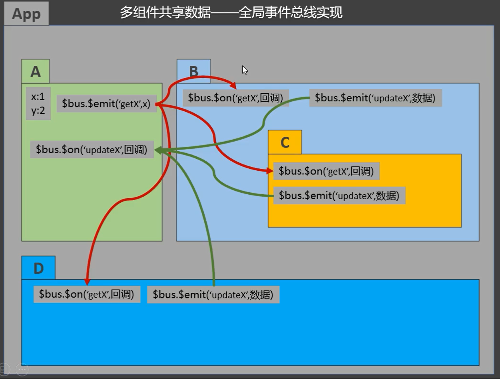

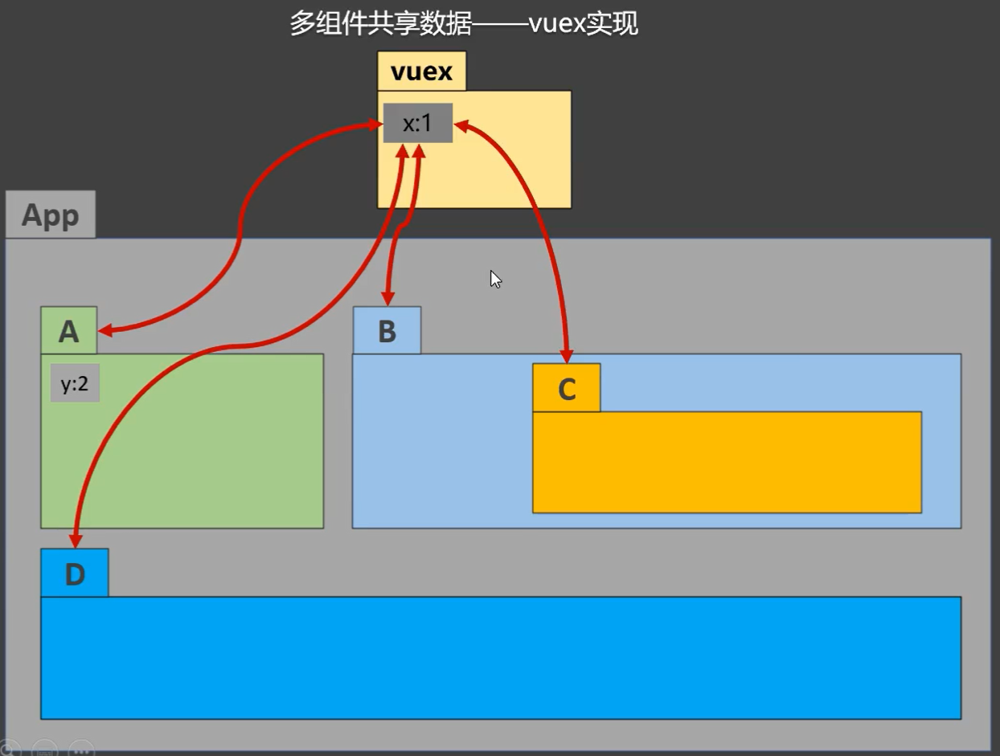

### 1.什么时候用vuex

1. 多个组件依赖同一状态
2. 来自不同组件的行为需要变更同一状态

### 2.vuex概念

在Vue中实现集中式状态(数据)管理的一个Vue插件,对vue应用中多个组件的共享状态进行集中式管理(读/写),也是一种组件间通信的方式,且适用于任意组件间通信.

### 3.何时使用

多个组件需要共享数据时

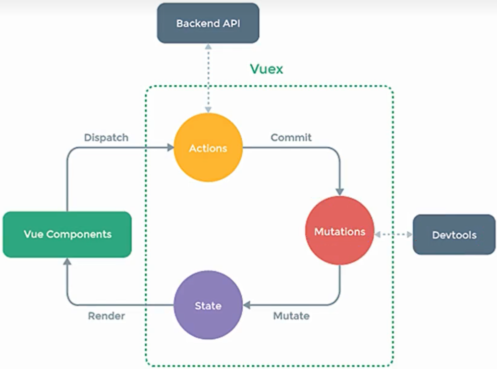

### 4.搭建vuex环境

1.创建文件`src/store/index.js`

```vue
// 该文件用于创建Vuex中的store
import Vuex from 'vuex'
import Vue from 'vue'
// 使用vuex插件
Vue.use(vuex)
// 准备actions---用于响应组件中的动作
const actions= {}
// mutations---用于操作数据(state)
const mutations = {}
// state---用于存储数据
const state = {}

const store = new Vuex.Store({
    actions:actions,
    mutations:mutations,
    state:state
})
export default store
```

2.在`main.js`中创建vm时传入store配置项

```vue
import Vue from 'vue'
import App from './App.vue'
import VueResource from 'vue-resource'
import store from './store'
Vue.config.productionTip = false
Vue.use(VueResource)
export const bus = new Vue()
new Vue({
  render: h => h(App),
  store,
  beforeCreate(){
    // 添加全局事件总线$bus
    Vue.prototype.$bus = this
  }
}).$mount('#app')
```

### 5.基本使用

1. 初始化数据,配置**actions**,配置**mutations**,操作文件**store.js**

   ```vue
   // 该文件用于创建Vuex中的store
   import Vuex from 'vuex'
   import Vue from 'vue'
   // 使用vuex插件
   Vue.use(Vuex)
   // 准备actions---用于响应组件中的动作
   const actions= {
       // jia(context,value){
       //     context.commit('jia',value)
       // },
       // jian(context,value){
       //     context.commit('jian',value)
       // },
       jiaOdd(context,value){
           if(context.state.sum%2){
               context.commit('jia',value)
           }
       },
       jiaWait(context,value){
           setTimeout(() => {
               context.commit('jia',value)
           }, 500);
       }
   }
   // mutations---用于操作数据(state)
   const mutations = {
       jia(state,value){
           state.sum+=value
       },
       jian(state,value){
           state.sum-=value
       }
   }
   
   // state---用于存储数据
   const state = {
       sum: 0,
   }
   
   export default new Vuex.Store({
       actions:actions,
       mutations:mutations,
       state:state
   })
   
   ```

2. 组件读取vuex中的数据:$store.state.sum

3. 组件中修改vuex中的数据:`$store.dispatch('action中的方法名',数据)`或`$store.commit('mutations中的方法名',数据)`

> 备注:若没有网络请求或其他业务逻辑,组件中也可以越过actions,既不写dispatch,直接编写commit

### 6.getters的使用

1. 概念:当state中的数据需要经过加工后再使用时,可以使用getters加工

2. 在store.js中追加getters配置

   ```vue
   //准备getters--用于将state中的数据进行加工
   const getters = {
       bigsum(state){
           return state.sum*10
       }
   }
   
   export default new Vuex.Store({
   		.....
       getters:getters
       .....
   })
   ```

3. 组件中读取数据:`$store.getters.bigsum`

### 7.四个map方法的使用

1. **mapState方法:**用于帮助我们映射state中的数据为计算属性

   ```
       computed: {
           // 借助mapState生成计算属性，从state中读取数据。（对象写法）
           ...mapState({
               sum: 'sum',
               school: 'school',
               subject: 'subject'
           }),
           // 借助mapState生成计算属性，从state中读取数据。（数组写法）
   				 ...mapState(['sum', 'school', 'subject'])
       },
   ```

2. **mapGetters方法:**用于帮助我们映射getters中的数据为计算属性

   ```
   	computed:{
   		//借助mapGetters生成计算属性，从getters中读取数据。（对象写法）
   		...mapGetters({
   			bigsum:'bigsum'
   		}),
   		//借助mapGetters生成计算属性，从getters中读取数据。（数组写法）
           ...mapGetters(['bigsum'])
   	}
   ```

3. **mapActions**方法:用于帮助我们生成与actions对话的方法,即包含$store.dispatch(xxx)的函数

   ```vue
       // 借助mapMutations生成对应的方法，方法中会调用commit去联系mutations(对象写法)
        ...mapMutations({ increment: 'jia', decrement: 'jian' }),
   
       //借助mapMutations生成对应的方法，方法中会调用commit去联系mutations(数组写法)
       ...mapMutations(['jia', 'jian']),
   ```

4. **mapMutations**方法:用于帮助我们生成与mutations对话的方法,即:$store.commit(xxx)的函数

   ```
       //借助mapActions生成对应的方法，方法中会调用dispatch去联系actions(对象写法)
       ...mapActions({ incrementOdd: 'jiaOdd', incrementWait: 'jiaWait' }),
       
       //借助mapActions生成对应的方法，方法中会调用dispatch去联系actions(数组写法)
       ...mapActions(['jiaOdd', 'jiaWait'])
   ```

   > 备注:mapActions与mapMutations使用时,若需要传递参数需要:在模版中绑定事件时传递好参数,否则参数是事件对象

   ```
   //例如这样传参
          <button @click="jia(n)">+</button>
           <button @click="jian(n)">-</button>
           <button @click="incrementOdd(n)">当前求和为奇数再加</button>
           <button @click="incrementWait(n)">等一等再加</button>
   ```


### 8.模块化＋命名空间

1. 目的:让代码更好维护,让多种数据分类更加明确

2. 修改`store.js`

   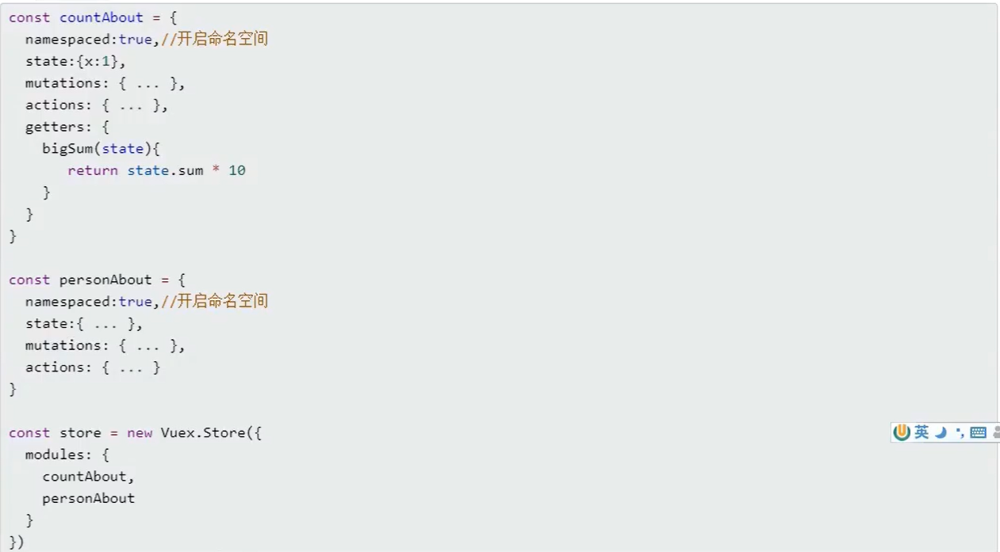

   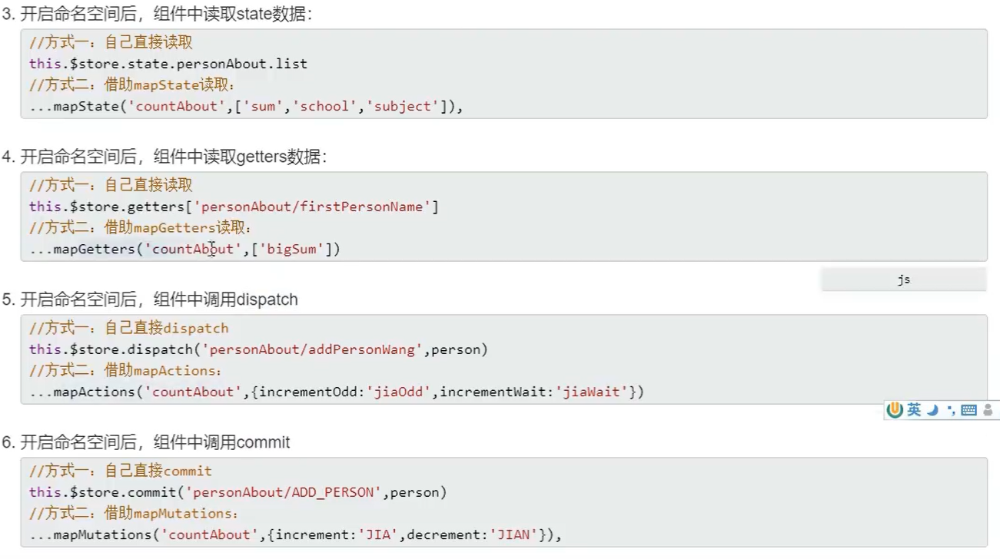

#### 具体案例

##### `store/index.js`

```js
// 该文件用于创建Vuex中的store
import Vuex from 'vuex'
import Vue from 'vue'
import countOptions from './count'
import personOptions from './person'
// 使用vuex插件
Vue.use(Vuex)
export default new Vuex.Store({
    modules:{
        countabout:countOptions,
        personabout:personOptions
    }
})
```

##### `count.vue`

```vue
<!--  -->
<template>
    <div class="">
        <h2>当前求和为:{{ sum }}</h2>
        <h4>当前求和为:{{ morebigsum }}</h4>
        <h4>我在{{ school }}{{ subject }}</h4>
        <h5 style="color: red;">person组件的总人数是:{{ personList.length }}</h5>
        <select v-model="n" name="" id="">
            <option :value="1">1</option>
            <option :value="2">2</option>
            <option :value="3">3</option>
        </select>
        <button @click="increment(n)">+</button>
        <button @click="decrement(n)">-</button>
        <button @click="jiaOdd(n)">当前求和为奇数再加</button>
        <button @click="jiaWait(n)">等一等再加</button>
    </div>
</template>
<script>
import { mapState, mapGetters } from 'vuex'
import { mapMutations, mapActions } from 'vuex'
export default {
    name: "count",
    data() {
        return {
            n: 1
        }
    },
    computed: {
        ...mapState('countabout',['sum','school','subject']),
        ...mapState('personabout',['personList']),
        // 借助mapState生成计算属性，从state中读取数据。（对象写法）
        // ...mapState({
        //     sum: 'sum',
        //     school: 'school',
        //     subject: 'subject',
        //     personList: 'personList'
        // }),
        ...mapGetters('countabout',{
            morebigsum: 'bigsum'
        }),
        //借助mapGetters生成计算属性，从getters中读取数据。（数组写法）
        // ...mapGetters(['bigsum'])
    },
    // 借助mapState生成计算属性，从state中读取数据。（数组写法）
//     computed: {
//     ...mapState(['sum', 'school', 'subject'])
//   },
methods: {
    // increment() {
    //     this.$store.commit('jia', this.n)
    // },
    // decrement() {
    //     this.$store.commit('jian', this.n)
    // },
    // 借助mapMutations生成对应的方法，方法中会调用commit去联系mutations(对象写法)
     ...mapMutations('countabout',{ increment: 'jia', decrement: 'jian' }),

    //借助mapMutations生成对应的方法，方法中会调用commit去联系mutations(数组写法)
    // ...mapMutations(['jia', 'jian']),

    // incrementOdd() {
    //     this.$store.dispatch('jiaOdd', this.n)
    // },
    // incrementWait() {
    //     this.$store.dispatch('jiaWait', this.n)
    // }
    //借助mapActions生成对应的方法，方法中会调用dispatch去联系actions(对象写法)
    // ...mapActions({ incrementOdd: 'jiaOdd', incrementWait: 'jiaWait' }),
    // //借助mapActions生成对应的方法，方法中会调用dispatch去联系actions(数组写法)
    ...mapActions('countabout',['jiaOdd', 'jiaWait'])
},
created() {

},
mounted() {

}
}
</script>
<style scoped>
button {
    margin-left: 5px;
}
</style>
```

##### `count.js`

```js
// 求和功能相关配置
const countOptions={
    namespaced:true,
    actions: {
        jiaOdd(context,value){
            if(context.state.sum%2){
                context.commit('jia',value)
            }
        },
        jiaWait(context,value){
            setTimeout(() => {
                context.commit('jia',value)
            }, 500);
        }
    },
    mutations: {
        jia(state,value){
            state.sum+=value
        },
        jian(state,value){
            state.sum-=value
        },
    },
    state: {
        sum: 0,
        school: '尚硅谷',
        subject:'前端',
    },
    getters: {
        bigsum(state){
            return state.sum*10
        }
    }
}
export default countOptions
```

##### `person.vue`

```vue
<!--  -->
<template>
  <div class="">
    <h2 style="color:green">count组件求和为:{{ sum }}</h2>
    <h2 style="color:green">count组件求和完为:{{ bigsum }}</h2>
    <h3>人员列表</h3>
    <h4>列表中第一个人的名字是:{{ firstpersonname }}</h4>
    <button @click="addwang">添加姓王</button>
    <button @click="addfree">添加一个二次元</button>
    <input type="text" v-model="name" placeholder="请输入名字">
    <button @click="add">添加</button>
    <ul v-for="(p,index) in personList" :key="p.id">
        <li> {{ p.name }} </li> 
    </ul>
  </div>
</template>
<script>
import {mapState} from 'vuex'
import {mapGetters} from 'vuex' 
import {mapMutations} from 'vuex'
import {mapActions} from 'vuex'
import { nanoid } from 'nanoid'
export default {
    name:"",
    data() {
        return {
            name:''
        }
    },
    computed:{
        ...mapState('personabout',{
            personList:'personList'
        }),
        ...mapState('countabout',{
            sum:'sum'
        }),
        ...mapGetters('countabout',{
            bigsum:'bigsum'
        }),
        ...mapGetters('personabout',['firstpersonname'])
    },
    components:{

    },
    methods:{
        ...mapMutations('personabout',{
            // add 是你在组件中定义的方法名，
            // 而 'addperson' 是你在 Vuex store 中定义的  名称。
            addp:'addperson'
        }),
        add(){
            const personObj = {id:nanoid(),name:this.name}
            this.addp(personObj)
            // this.$store.commit('personabout/addperson',personObj)
            this.name=''
        },
        addwang(){
            const personObj = {id:nanoid(),name:this.name}
            this.$store.dispatch('personabout/addpersonwang',personObj)
        },

        addfree(){
            this.$store.dispatch('personabout/addpersonServer')
        }
    },
    created() {

    },
    mounted() {

    }
}
</script>
<style scoped>

</style>
```

##### `person.js`

```js
import axios from 'axios'
import { nanoid } from 'nanoid'

//人员管理相关配置
const personOptions={
    namespaced:true,
    actions: {
        addpersonWang(context,value){
            if(value.name.indexOf('王')===0){
                context.commit('addperson',value)
            }else{
                alert('添加的人必须姓王')
            }
        },
        addpersonServer(context){
            axios.get('https://api.lolimi.cn/API/naen/api.php').then(
                response=>{
                    // console.log(response.data.data.name);
                    context.commit('addperson',{id:nanoid(),name:response.data.data.name})
                },
                err=>{
                    console.log(err);
                }
            )
        }
    },
    mutations: {
        addperson(state,value){
            state.personList.unshift(value)
        }
    },
    state: {
        personList:[
            { id: '001', name: '张三'}
        ]
    },
    getters: {
        firstpersonname(state){
            return state.personList[0].name
        }
    }
}
export default personOptions
```


## 12、路由含义

- 服务器端的路由： 一个地址指向一个资源页面！

- 前端的路由：

  - 框架是开发都是单页面（SPA）引用！ 
    - single page application   单页面应用！
    - 例：https://x.dscmall.cn/mobile#/catalog
      - 优点：
        - 体验感好
        - 组件化开发
      - 缺点：
        - 不利于seo
        - 首页加载慢
    - multiple page appliction 多页面应用！
      - 优点：
        - seo友好
      - 缺点：
        - 复用不好、性能

### 1、vue-router

- 实现了路由的管理的库！ 是vue生态圈里非常重要的内容！

- 文档地址：https://router.vuejs.org/zh/

- 使用：

  - 单独安装vue-router

    ```js
    npm i vue-router@3 --save
    ```

  - 在src下面创建router文件夹，下面创建index.js

    ```js
    import Vue from "vue";
    import VueRouter from "vue-router";
    
    // Vue.use(插件名)   安装插件！
    Vue.use(VueRouter);
    
    // 引入页面组件
    import 组件A from "@/pages/组件A"
    import 组件B from "@/pages/组件B"
    import 组件C from "@/pages/组件C"
    
    // 实例化一个路由对象
    let router = new VueRouter({
       routes:[
         { path:"/a",component:组件A },
         { path:"/b",component:组件B },
         { path:"/c",component:组件C },
       ]
    })
    
    ```

  - 在App.vue 模板里面写入`router-view`标签，路由地址切换之后对应的组件内容展示在这里！

  - 使用`router-link`实现a标签。 to的值就是 路由映射配置里面的path内容

  - ```
    <router-link to="/home" active-class="active">home</router-link>
    <router-link to="/about" active-class="active">关于</router-link>
    		<router-view></router-view>
    ```

- **推荐在脚手架初始项目的时候就选择安装vue-router,自动设计好所有配置！**

> 注意点:
>
> 1. 路由组件通常放在**pages**文件夹,一般组件通常放在**components**文件夹
> 2. 通过切换,"隐藏了"的路由组件爱你,默认是被销毁掉的,需要的时候再去挂载
> 3. 每个组件爱你都有自己的$route属性,里面存储着自己的路由信息
> 4. 整个应用至于一个router,可以通过组件的$router属性获取到

### 2、404配置

- 默认情况下，访问一个没有被定义的路由地址， 页面是不会渲染任何内容。我们可以给他制定到404页面！

- 实现

  ```js
  //重定向 
  {
      path:'/',
      redirect:"/home"
    },
  //404
  {
  	routes:[
  	   { path:"*",component:404组件 }
  	]
  }
  ```

### 3、动态路由

###### (REST)

​	#/goods/1130/answer=121212

​	#/goods/1131

​	#/goods/1133

​	.....

###### 写法二(查询字符串)

#/detail?goods_id=664&answer=121212

- 使用场景：

  -    新闻列表 到新闻详情     详情需要知道新闻id。
  -    新闻分类 到新闻列表    新闻列表需要知道新闻分类id
  -    愿望： 实现页面之间的传递参数

- 使用：

  ```js
  {
    routes:[
    		 { path:"/地址A/:标识符",component:组件A },
    ]
  }
  ```

  ```html
  <router-link to="/地址A/数据"></router-link>
  ```

  ```js
  // 组件A里面
  this.$route.params.标识符
  ```

  **实现了两个页面之间的传参！**

- 注意：

  - 当我们在main.js中将路由挂载到vue实例上面去之后， 所有的组件对象里面都会多两个属性，一个$router,$route
    - $router表示这个路由实例对象！
    - $route 表示当前页面的路由信息！
      - this.$route.params   动态路由数据
      - this.$route.name   路由名称
      - this.$route.meta   元数据！
      - this.$route.query   search参数！
      - this.$route.matched   路径信息

#### 总结:

REST风格写法,需要修改router/index.js中的路由规则,使用$route.params对象获取传递的参数

查询字符串写法,不需要修改路由规则,使用$route.query对象获取传递的参数

### 4、嵌套路由

#### 1.配置路由规则,使用children配置项

```js
{
	routes:[
			{
			  path:"/地址A",    //一级路由
			  component:组件A,   
			  children:[   // 二级路由， 二级路由的组件 (组件aa，组件bb,组件cc都展示在组件A的模板里面的router-view里面，而不是顶级的router-view)
			  		{ path:"aa",component:组件aa },//此处一定不要写/aa
			  		{ path:"bb",component:组件bb },//此处一定不要写/aa
			  		{ path:"cc",component:组件cc }//此处一定不要写/aa
			  ]
			}
	]
}
```

#### 2.跳转(要写完整路径):

```vue
<router-link to="/地址A/aa">news</router-link>
```

### 5、元信息c

```js
routes:[
	{ 
		path:"/地址",
		component:"组件"
		meta:{  key:val }   // 元信息，表示给这个路由设置一些自定义属性！
	}
]
```

```js
this.$route.meta.key    // 可以获取数据！
```

路由守卫中拿元信息

```
router.afterEach((to,from)=>{
        document.title = to.meta.val;
        next()
    })
```


### 6、导航守卫

#### 1.全局前置和全局后置守卫

- 守卫：进入路由、离开路由、更新路由的时候自动执行的函数。 又称之 路由钩子函数！ 

- ```js
  let router = new Router({})
  // 前置守卫:路由切换前执行
  router.beforeEach(function(to,from,next){
    // 所有路由都走这里处理
    next()
  })
  
  // 后置守卫！:路由切换后执行
  router.afterEach((to,from)=>{
     console.log("全局：我走了")
  })
  
  export default router;
  ```

#### 2.独享路由守卫

规定进入某一个路由之前的逻辑

```js
{
                    name:'newss',
                    path:'news',
                    component:news,
                    meta:{
                        istrue:false
                    },
                    beforeEnter:(to,from,next)=>{
                        console.log("to=====",to,"from====",from,"next====",next);
                        if(to.meta.istrue){
                            next()
                        }else{
                            alert('istrue为false')
                        }
                   }
                },
```

> 可以配合全局路由后置守卫一起使用

#### 3.组件内路由守卫

```js
 //通过路由规则,进入该组件时被调用
    beforeRouteEnter(to,from,next){
      console.log('组件前守卫');
      next()
    },
    //通过路由规则,离开该组件时被调用
    beforeRouterLeave(to,from,next){
      console.log('组件后守卫');
      next()
    },
```

### 7、路由懒加载

- 原来的路由配置文件里面都是通过import 导入所有的组件！这样做，应用开始的时候就会导入这些所有的组件。增加了负担！

- **希望打开哪个路由地址的时候就再去加载对应的路由组件。 这就是路由懒加载！**

  ```js
  import 组件名 from "@/pages/组件名"
  {
  	  path:"/地址",
  	  component:组件名
  }
  ```

  ```js
  {
  	 path:"/地址",
  	 component:()=>import("@/pages/组件名")
  }
  ```


### 8、路由的query参数

#### 1.传递参数(两种写法)

```vue
 <li v-for="m in  messlist" :key="m.id">
            <!-- 跳转路由并携带query参数,to的字符串写法 -->
            <router-link :to="`/home/message/detail?id=${m.id}&title=${m.title}`">{{ m.title }}</router-link>
            <!-- 跳转路由并携带query参数,to的对象写法 -->
            <router-link :to="{
                  path:'/home/message/detail',
                  query:{
                        id:m.id,
                      title:m.title
                    }
                }">{{ m.title }}</router-link>
        </li>
```

#### 2.接收参数:

```vue
$router.query.id
$router.query.title
```

### 9、命名路由

1. 作用:可以简化路由的跳转

2. 如何使用

   1. 给路由命名:

      ```js
      routes: [
              {   
                  name:'aboutt',
                  path: "/about",
                  component: about
              },
              ]
      ```

   2. 简化跳转:

      ```js
      <!--简化前,需要写完整路径-->
      <router-link to="/demo/test/about">跳转</router-link>
      <!--简化后,直接通过名字跳转-->
      <router-link to="{name:aboutt}">跳转</router-link>
      ```

### 10、路由的params参数

1. 配置路由,声明接受params参数

   ```js
           {   
               name:'homee',
               path: "/home",
               component: home,
               children:[
                   {
                       path:'news',
                       component:news
                   },
                   {
                       path:'message',
                       component:message,
                       children:[
                           {   
                               name:'xiangqing',
                               path:'detail/:id/:title',//使用占位符接受声明params参数
                               component:detail
                           }
                       ]
                   },
               ]
           }
       ]
   })
   ```

2. 传递参数

   ```js
   <!--to字符串写法-->
   <router-link :to="`/home/message/detail/666/aaa`">{{ m.title }}</router-link>
    <!--参数为{666,aaa}-->
    <router-link :to="`/home/message/detail/${m.id}/${m.title}`">{{ m.title }}</router-link>
    <!--to对象写法-->
     <router-link :to="{
                     name:'xiangqing',
                     params:{
                           id:m.id,
                         title:m.title
                       }
                   }">{{ m.title }}</router-link>
   ```

   > **<u>*特别注意:路由携带params参数时,若使用to的对象写法,则不能使用path配置项,必须使用name配置*</u>**

3. 接受参数:

   ```
   $route.params.id
   $route.params.title
   ```


### 11、路由的props配置

作用:让路由组件更方便的收到参数

```js
{   
                            name:'xiangqing',
                            path:'detail/:id/:title',
                            component:detail,
                            // props的第一种写法,值为对象,该对象中的所有key-value
                            // 都会以props的形式传给detail组件
                            // props:{a:1,b:'hello'}
                              
                            //props的第二种写法,值为布尔值,r若布尔值为真,
                            // 就会把该路由组件收到的所有params参数以props的形式传给detail组件
                            // props:true,
                              
                            // props的第三种写法,值为函数
                            // props($route){
                            //     return {
                            //  						id:$route.query.id,
                            //							title:$route.query.title
                            //         }
                            //     }
                            props({query:{id,title}}){
                                return{id,title}
                            }//连续解构赋值写法
                        }
```

接收

```
 props:['id','title']
```

### 12、`<router-link>`的replace属性

1. 作用:控制路由跳转时操作浏览器历史记录的模式
2. 浏览器的历史记录有两种写入方式:分别是push和replace,push是追加历史记录,replace是替换当前记录.路由跳转时默认是push
3. 如何开启replace模式:`<router-link replace :to="{name:'homee'}">to home</router-link>`

### 13、编程式路由导航

1. 作用:不借助`<router-link>`实现路由跳转.让路由跳转更加灵活

2. 具体编码:

   ```vue
       methods:{
           pushshow(m){
               this.$router.push({
                   name:'xiangqing',
                   query:{
                       id:m.id,
                       title:m.title
                   }
               })
           },
           replaceshow(m){
               this.$router.replace({
                   name:'xiangqing',
                   query:{
                       id:m.id,
                       title:m.title
                   }
               })
           }
   		back() {
   			this.$router.back()//后退
   		},
   		forward() {
   			this.$router.forward()//前进
   		}
   		gogogo(){
   		this.$router.go(3)//前进3步
   }
       },
   ```


### 14、缓存路由组件

1. 作用:让不展示的路由组件保持挂载,不被销毁

2. 具体编码:

   ```vue
       <keep-alive include="news">
         <router-view></router-view>//要缓存的组件的展示位置
       </keep-alive>
   //缓存多个
   		<keep-alive :include="['news','message']">
         <router-view></router-view>
       </keep-alive>
   
   ```

   > include里写组件的命名

### 15、两个新的生命周期钩子

1. 作用:路由组件独有的两个钩子,用于捕获路由组件的激活状态

2. 具体名字:

   ```vue
   		activated(){
           console.log("activated");
       },//路由组件被激活时触发
       deactivated(){
           console.log("deactivated");
       },//路由组件失活时触发
   ```


#### 16、路由器的两种工作模式

1. 对于一个url来说,什么是hash值?-------#及其后面的内容是hash值(前端hash值)

2. hash值不会包含在http请求中,即hash值不会带给服务器

3. hash模式:

   1. 地址中永远带着#号,不美观
   2. 若以后将地址通过第三方手机app分享,若app效验严格,则地址会被标记为不合法
   3. 兼容性较好

4. History模式:

   1. 地址干净美观

   2. 兼容性和hash模式相比略差

   3. 应用部署上线时需要后端人员支持,解决刷新页面服务器404的问题

   4. 后端解决方案:

      1. ngnix

      2. express使用connect-history-api-fallback中间件

         ```js
         const express = require('express');
         var history = require('connect-history-api-fallback');
         const app = express();
         app.listen(3000, () => console.log('Example app listening on port 3000!'));
         // 必须在静态资源use之前使用
         app.use(history());
         app.use(express.static(__dirname+'/static'))
         app.get('/person', (req, res) => {
             res.send({
                 name: "John Doe",
                 age: 30,
                 city: "New York",
                 age:18
             });
             })
         ```

         

## 5、axios的使用

AJAX（Async JavaScript AND XML）；本质上是在网页中利用 XMLHttpRequest 对象和服务器进行数据交互的方式。ajax技术可以使网页实现异步更新，**达到不刷新页面即可对网页的内容进行更新**，解决了传统方法的缺陷。

ajax技术目前广泛应用在前后端分离的开发模式中，可以实现实时更新网页的交易信息、注册验证、分页等等。


- 前后端分离。数据请求都要通过ajax实现！ 原生的使用不方便。 使用一些第三方库。  比如jQuery的`$.ajax`。

- axios就是一个请求库。

- 文档地址：http://axios-js.com/

- 中文文档：https://www.axios-http.cn/

- 基本语法：

- ```js
  axios({
     url:"请求地址",
     method:"请求方式",
     data:{  post提交参数},
     params:{ get提交参数 }
  }).then(res=>{ res就是相应信息，res.data 才是真正的后端返回的内容 })
  ```

  ### 
  
  

### 5.1 axios在vue-cli中使用

- 安装：

  ```js
  npm i axios --save 
  ```

- 创建一个js文件。 这个JS文件中进行axios的相关配置

- 创建`common/http.js`配置axios

  - 创建实例
  - 配置拦截器

  ```js
  // 配置axios相关信息
  
  import axios from "axios";
  
  let $axios = axios.create({
      baseURL:"",
      timeout:3000
  })
  
  // 配置拦截器
  // 拦截器需要配置 axios使用 之前！
  // 添加请求拦截器
  $axios.interceptors.request.use(function (config) {
      // 在发送请求之前做些什么
      return config;   // 一定要return config ，否则 请求无法成功！
  }, function (error) {
      // 对请求错误做些什么
      return Promise.reject(error);
  });
  
  // 添加响应拦截器
  $axios.interceptors.response.use(function (response) {
      // 对响应数据做点什么
      return response;    // return 内容，否则具体的请求响应里面获取不到数据！
  }, function (error) {
      // 对响应错误做点什么
      return Promise.reject(error);
  });
  
  // 暴露出去！
  export default $axios;
  ```

- 在main.js中挂载到原型上面，让所有组件都可以使用

  ```
  // 将axios实例挂载到vue原型上面，可以在所有组件中使用！
  import $axios from "./common/http"
  Vue.prototype.$axios = $axios;
  ```

- 在组件中通过`this.$axios来调用`


## 6、项目搭建 

### 6.1、element-ui使用

- UI框架

  - 管理系统
    - Element-ui   https://element.eleme.cn/#/zh-CN/component/installation
    - iview   https://www.iviewui.com/
    - Antdesign   https://www.antdv.com/docs/vue/introduce-cn/
  - 界面
    - Minit-ui  https://mint-ui.github.io/#!/zh-cn
    - Vant-ui  https://youzan.github.io/vant/#/zh-CN/
    - Ydui   http://vue.ydui.org/

- element-ui    UI框架！   为了快速布局页面！

- 安装element-ui

  - 安装

    ```
    npm i element-ui --save-dev
    ```

  - main.js引入

    ```js
    import Vue from 'vue';
    import ElementUI from 'element-ui';
    import 'element-ui/lib/theme-chalk/index.css';
    import App from './App.vue';
    
    Vue.use(ElementUI);
    
    ...
    ```

  - 使用组件,直接复制使用组件即可！

    ```
    <el-button>默认按钮</el-button>
    ```
